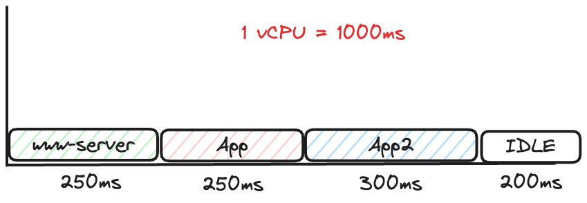
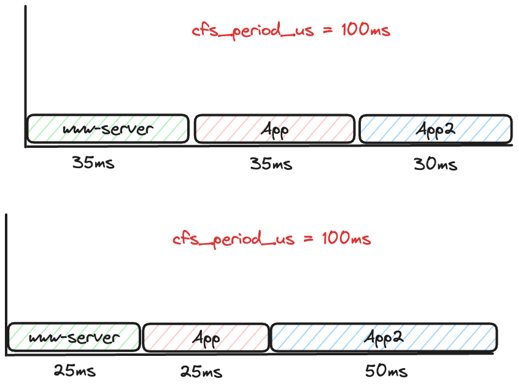
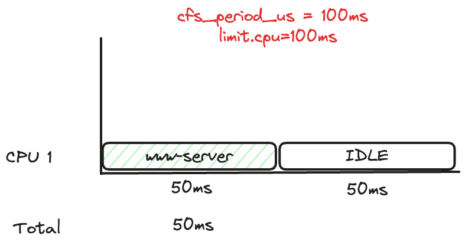
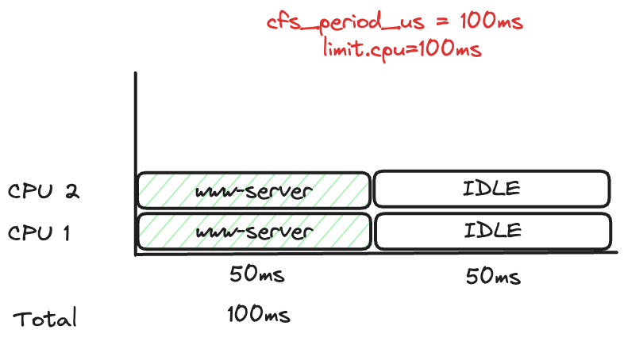
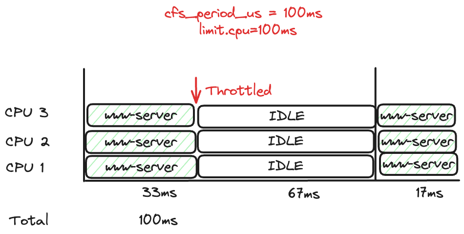
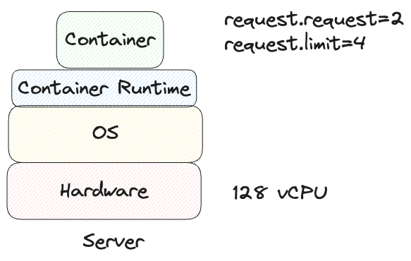
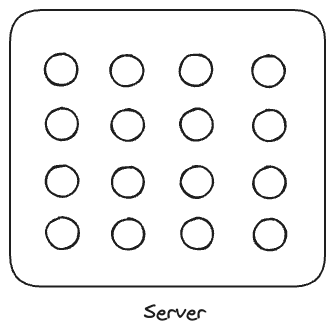
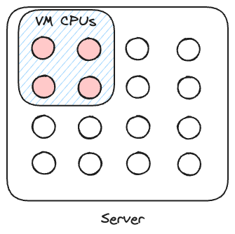
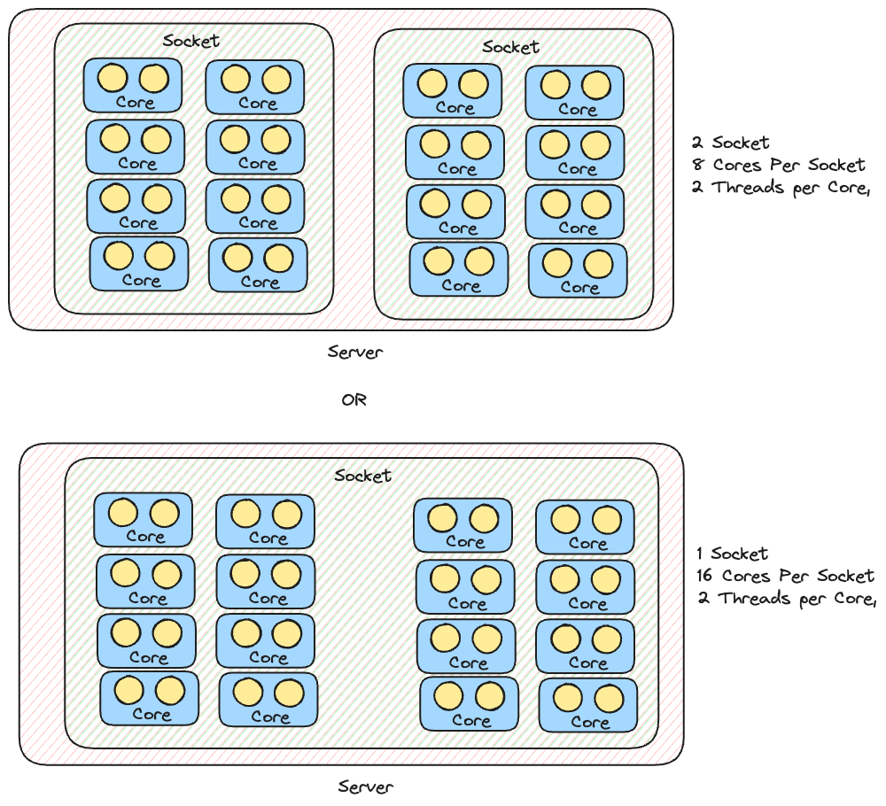
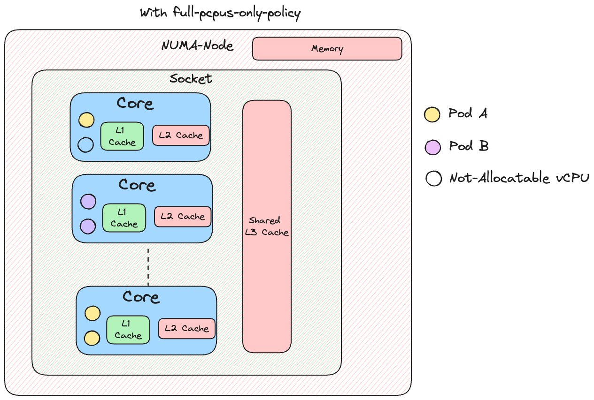

# 同樣 2vCPU 的 Kubernetes Container 為什麼會比 VM 效能差

隨者 Kubernetes 與 Container 概念的崛起與流行，許多團隊除了將新的應用直接開發部署到 Kubernetes 上，也會需要將既有的服務從轉移到容器中
而這些既有的服務可能是直接部署於裸機或是虛擬機(Virtual Machine, VM)上。

Container 主打 "Build Once, Run Everywhere"，讓開發團隊與維運團隊可以用更輕鬆與系統的方式去管理應用程式，但是很常都會看到應用程式原封不動搬移過來後效能不如預期的現象。

本文主要會從 CPU 方向去探討，為什麼將服務從 VM 搬移到 Kubernetes(Container) 世界中可能存在的一些問題，以及這些問題為什麼會導致效能不如預期
應用程式本身效能瓶頸是 Network I/O 或是 Disk I/O 的則不在本文討論範圍


# CPU Throttling

## Background

過往使用 VM 來部署服務時，通常都是要求一個固定大小的系統資源，譬如給我一台 4 vCPU, 16 GB 規格的 VM，接者使用者就可以自己連線到 VM 內安裝運行自己需要的應用程式。

然而到 Kubernetes 的世界中，容器化的應用程式部署非常容器，但是為了避免影響其他容器與耗盡資源，都會要求部署 Pod 的時候妥善設定 resource.request 以及 resoruce.limit。

當應用程式使用資源達到 resource.limit 設定時則會發生對應的處置動作，對於 CPU 來說則是會有 CPU Throttling，而 Memory 則是會有 Out-Of-Memory Killer

有些應用程式開發者沒有妥善設定 resource.limit 與程式運作邏輯的情況下，就很容易觸發 CPU Throttling 的情況，很常見的就是 p95, p99 的整個反應不如預期，或是 Thread 愈開愈多結果運行情況反而愈來愈慢的情況。

而 VM 的情況下完全不需要去考慮這麼多資源設定的問題，因此也不會觸發 CPU Throttling 等問題而被降速，因此接下來就來仔細探討到底何謂 CPU Throttling 以及為什麼觸發會導致效能不如預期


## Ｗhat Is CPU Throttling

閱讀過文件的讀者勢必常常聽到 Kubernetes 透過 cgroup 來管理容器運行的所需資源，要理解 CPU Throttling 就必須要先理解 cgroup 實務上與 Kubernetes 內 resources.request/limit 的關係是什麼

CPU Request 於 Kubernetes 中有兩個用途
1. Kubernetes 將 Pod 內所有 Container 的 Request 加總計算，使用該數值來過濾沒有足夠資源被調度的節點，這部分主要是跟 Scheduling 有關
2. Linux Kernel CFS(Completely Fair Scheduler) 來指派 CPU 對應的時間給目標容器

假設我們部署下列服務，該服務有三個 Container， CPU Request 分別是 250m, 250m 與 300m.
```yaml=
apiVersion: apps/v1
kind: Deployment
metadata:
  name: www-deployment-resource
spec:
  replicas: 1
  selector:
    matchLabels:
      app: www-resource
  template:
    metadata:
      labels:
        app: www-resource
    spec:
      containers:
        - name: www-server
          image: hwchiu/python-example
          resources:
            requests:
              cpu: "250m"
        - name: app
          image: hwchiu/netutils
          resources:
            requests:
              cpu: "250m"
        - name: app2
          image: hwchiu/netutils
          resources:
            requests:
              cpu: "300m"
```

假設大家都同意 1 vCPU = 1000ms，則上述的使用量可以繪製成下列圖表



但是 CPU 的運行並不是以 1秒(1000ms) 為單位，CFS 運行的時候會根據 cgroup 內的參數 **cfs_period_us** 來決定每次運行的週期，預設情況下都是 100ms

因此上述的設定轉換到實際的運行情況更像是


但是 CPU 資源本身是互相競爭的，要如何確保這些應用程式於每個週期內至少有對應的時間可以用？
CFS 使用 CPU shares 的設定來確保應用程式可以於每個週期內使用到自已所要求的時間，這部分可以想成是運行時間的下限，剩下多出來的時間則就交給彼此去競爭。

上述的範例來看，三個應用程式於 100ms 的時間點內所要求的時間量分別為
25ms, 25ms, 30ms，而剩下的 20ms 則由三者去搶奪，所以實務上有可能發生多種組合情形，譬如



不論是哪種類型，都至少滿足 CPU Share 的請求，有符合最低使用情境。

若環境是 cgroup v2 的話，底層則是使用 cpu.weight     的方式來實作
```bash=
ubuntu@hwchiu:/sys/fs/cgroup/kubepods.slice/kubepods-burstable.slice/kubepods-burstable-podacdcc83d_4cca_4271_9145_7af6c44b1858.slice$ cat cri-containerd-*/cpu.weight
12
10
10

ubuntu@hwchiu:/sys/fs/cgroup/kubepods.slice/kubepods-burstable.slice/kubepods-burstable-podacdcc83d_4cca_4271_9145_7af6c44b1858.slice$ cat cpu.weight
32
```

上述範例可以看到 CPU Weight 之間是以比例的方式去計算，25:25:30 也就是 10:10:12，而總額則是 32

而 CPU Limit 於 Kubernetes 中的說明是一個 CPU 使用上限，當 CPU 用量達到此程度時就會觸發 CPU Throttling，因此可以想成是 CPU 使用量的天花板

將上述的 YAML 改為下列範例，該範例中對每個應用程式加入對應的 Limit
```bash=
apiVersion: apps/v1
kind: Deployment
metadata:
  name: cpu-limit
spec:
  replicas: 1
  selector:
    matchLabels:
      app: www-resource
  template:
    metadata:
      labels:
        app: www-resource
    spec:
      containers:
        - name: www-server
          image: hwchiu/python-example
          resources:
            requests:
              cpu: "250m"
            limits:
              cpu: "300m"
        - name: www-server2
          image: hwchiu/netutils
          resources:
            requests:
              cpu: "250m"
            limits:
              cpu: "300m"
        - name: www-server3
          image: hwchiu/netutils
          resources:
            requests:
              cpu: "300m"
            limits:
              cpu: "350m"
```

一樣以 100ms 這個週期來看應用程式的分佈


當應用程式只要使用到超過目標的時間後，就會陷入 Throttle 的狀態，沒有辦法繼續使用 CPU，所以上述的範例假設三個應用程式都想要去競爭多餘的 CPU，最終就會產生如下圖所示


最終 CPU 會有 5ms 的 IDLE 時間，因為這三個應用程式都被 Throttled，沒有多餘的額度可以繼續運行了。

cgroup v1 則是透過 cpu quota(cfs_quota_us, cfs_period_us) 的參數來指定能夠運行的時間，而 cgroup v2 則是依據 cpu.max 來設定

```bash=
ubuntu@hwchiu:/sys/fs/cgroup/kubepods.slice/kubepods-burstable.slice/kubepods-burstable-podacdcc83d_4cca_4271_9145_7af6c44b1858.slice$ cat cri-containerd-*/cpu.max
35000 100000
30000 100000
30000 100000

ubuntu@hwchiu:/sys/fs/cgroup/kubepods.slice/kubepods-burstable.slice/kubepods-burstable-podacdcc83d_4cca_4271_9145_7af6c44b1858.slice$ cat cpu.max
95000 100000
```

可以看到上述三個 Container 被放到同一個 K8s Pod 裡面，且每個 container 的 CPU.MAX 被設定成 35000(ns), 30000(ns) 與 30000(ns)
而 Pod 本身的 cpu.max 則是計算成所有 container 的加總 95000(ns)

根據上述的基本理解，目前知道當服務踩到 CPU Throttling 時會使得應用程式於每個 CPU 週期內能夠使用的時間有限，當發生時就沒有辦法繼續運行，即使當下的 CPU 是空閑的。


## Thread
CPU Throttling 聽起來是個非常合理且正常的行為，那什麼情況下會使得服務運作不如預期，甚至前面所提到的 p95, p99 的效能不好？

CPU Share 使用的計算是以該 Container Process 去計算的，所以假如該 Process 本身會產生多個 Thread，則計算方式則是所有 Thread 完全加總。

假設今天部署一個應用程式，該應用程式的 Limit 是 100ms，但是其 CPU 工作只需要 50ms就可以完成



基本使用上完全沒有任何問題。
今天突然想要增加 Thread 的數量，使用兩個 Thread 來運行



由於每個 Thread 都需要花費 50ms，兩個加種剛好 100ms，也沒有超過 limit(quota) 上限，因此使用起來也沒有任何問題

但是當開啟 3 個 Thread 的時候會發生什麼事情?(假設系統上至少有三個 vCPU 可用)


因為總量只有 100ms，由三個 thread 各自去競爭，所以平均情況下每個 thread 都只能用到 33ms，最終就觸發了 Throtteld 機制，每個 Thread 於剩下的 idle(67ms) 什麼事情都不能完成

於是所有的 Thread 都必須要等待直到第二個 CPU 週期才可以繼續跑完所需要的工作


第二個週期開始，每個 Thread 大概只需要 17ms 左右就可以滿足，雖然最終三個 Thread 都順利完成，但是每個 Thread 從開始到結束實際上卻花了 117 秒(100+17) 秒，其中工作 50ms，idle 67 秒。

若將上述的範例改為 8 個 Thread，整個情況會變得更加嚴重，如下圖


這個情況下， Thread 於每個 CPU 週期只能用到 12.5 ms，因此需要至少五個週期才可以跑完全部的工作
因此本來 50 ms 的工作最後卻花費了 412.5 ms，這嚴重的情況甚至會導致 Client 的請求 timeout 或是 latency 暴增

因此不正確的 Thread 數量與 CPU Limit 將會有機會使得應用程式大量的觸發 CPU Throttled，雖然 CPU 最終都還是可以運行完畢，但是每個工作所花費的時間都會被拉長，最終就會反應為 P95, P99 系統忙碌情況下的效能。

## How To Avoid

避免 CPU Throttling 的方式有兩種方式
1. 提高 CPU Limit 的用量
2. 檢視應用程式的 Thread 用量是否不正確

提升 CPU Limit 的用量是最直接的，但是設定多少 CPU Limit 才是一個適當的數值則沒有一個正確的檔案，普遍來說都推薦搭配 Monitoring 系統去觀測資料來評估一個合適的數值，此外若本身也在意 Pod QoS 的話，Limit 的設定也就不能亂給，而是必須要有所本的與 Request 一致

Thread 的數量這部分則需要仰賴應用程式開發者去注意，Thread 的數量通常由兩種方式設定
1. 使用者自行設定需要的數量
2. 程式語言本身或是框架自動偵測


(1) 的部分仰賴程式開發者的撰寫，這部分如果要手動設定的話還需要同步 Kubernetes Resource 的設定，譬如因應需求開啟更多 Thread 那就可能需要調整 limit.CPU 與 request.CPU 的設定避免觸發更頻繁的 CPU Throttling

至於(2) 的自動偵測部分則還是要仰賴應用程式開發者熟悉自己所使用的程式語言與框架，以下列範例來說，運行一個 (request: 2vCPU, limit: 4vCPU) 的容器到一台擁有 128 vCPU 的伺服器上時，這些程式語言或是程式框架到底是基於何種數字去自動調整數量，這部分沒有一定答案，所以開發者一定要仔細確認自己所使用的語言與框架，到底怎麼處理的。



以 Java 來說，版本 [8u131](https://bugs.openjdk.org/browse/JDK-8146115) 後就有能力去偵測 Container 環境下的系統資源，否則過往的 Java 應用程式是會基於實體機器 (128 vCPU) 去設定需要的 Thread 數量，這種情況下就會非常容易觸發 Throttling。

## Monitor

如果環境中有安裝 Promehteus 的話，可以透過下列三個指標來觀測應用程式是否有遇到 CPU Throttling 的情況，分別是

1. container_cpu_cfs_throttled_seconds_total
2. container_cpu_cfs_periods_total
3. container_cpu_cfs_throttled_periods_total


container_cpu_cfs_throttled_seconds_total 這個指標會以秒數為單位去紀錄目標 Container 目前總共被 Throttled 多少時間，秒數為單位，類型為 Counter，因此使用上需要搭配
rate 等之類的函數去觀測變異量，同時要注意的是這個指標回傳的是總量，所以若應用程式本身使用的 Thread 數量過多時，有可能統計出來的結果秒數會非常高，使用上要特別注意如何閱讀此指標。

因此實務上更傾向同時使用後面兩個指標，**container_cpu_cfs_periods_total** 是個 Counter，代表的是該容器目前累積至今所有經歷過的 CPU Cycle, 也就是 CFS periods(100ms)，而後者 **container_cpu_cfs_throttled_periods_total** 一樣的計算方式，只是計算的是有多少 periods 內發生過 CPU Throttling。

相對於前者直接計算秒數，透過後兩者指標的計算，**container_cpu_cfs_throttled_periods_total** / **container_cpu_cfs_periods_total** 可以獲得一個 Throttling 的百分比

以下列範例來說，應用程式總共需要五個 period，其中四個 period 有發生 CPU Throttling 的情況，因此計算出來的百分比就是 4/5 = 80%


另外要注意的是因為這些指標都是累積至今以來所有的資料，而我們在意的並不是從頭至今的所有資料，而是最近當下的運算情況，因此需要透過 increase 等之類的表達式來計算差異，並且根據差異再進行百分比的換算

舉例來說

```
sum(increase(container_cpu_cfs_throttled_periods_total{container!=""}[5m])) by (container, pod, namespace)
                /
sum(increase(container_cpu_cfs_periods_total[5m])) by (container, pod, namespace)
```

透過 Grafana/Prometheus 等工具監控應用程式效能時， CPU Throttling 也是一個值得注意的領域。

# Exclusive CPU

## Background

另外一個影響 Container 與 VM 之間 CPU 效能的因素就是 CPU 的使用效率，先試想下列情境
有一台有 16 vCPU 的 Server，然後有一個會希望可以使用到 4 vCPU 且有 4 條 Thread 的服務要部署，那以 Container 或是 VM 來運行的時候可能會有什麼不同差異？

下圖代表的是一個有 16 vCPU 的伺服器狀況，每一個圈圈都代表一個 vCPU




以 VM 來說，常見的範例是固定 4 vCPU 給 VM 專門使用，接者該服務就會於該 4 vCPU 上由 VM 的 Kernel 去自行調度使用。




但是對於 Container 來說，因為資源是共享，而且 CPU (request) 的概念是每個時間區間要滿足 4 vCPU 的用量，因此實務上
到底是使用哪些 CPU 並不是被肯定的，所以有 4thread 的應用程式運行的 CPU 分佈可能有下列情況，而這些情況是隨者時間會變化的。


那為什麼 CPU 分佈會影響到效能問題？ 這個問題要先回歸到 CPU 的基本概念，為什麼我們平常會講 CPU 但是到雲端世界中我們就用 vCPU(Virtual CPU)來形容？

隨者技術的發展，仰賴於 Hyper Threading 技術的發展，每個物理 CPU 可以運行多個 Thread(亦稱 virtual CPU，此 Thread)，習慣上會稱物理 CPU 為 Core
而 Socket 上則會有眾多 Core。

以下列機器來說，可以透過 `lscpu` 指令來觀看 CPU 的一些細節

```bash=
ubuntu@blog-test:~$ lscpu
Architecture:                       x86_64
CPU op-mode(s):                     32-bit, 64-bit
Byte Order:                         Little Endian
Address sizes:                      46 bits physical, 57 bits virtual
CPU(s):                             32
On-line CPU(s) list:                0-31
Thread(s) per core:                 2
Core(s) per socket:                 16
Socket(s):                          1
NUMA node(s):                       1
```


上述範例可以看到
1. 有 1 個 Socket
2. 每個 Socket 有 16 Core
3. 每個 Core 有 2 個 Thread

所以最後計算出來就是 1*16*2 = 32 個 vCPU

而下列指令則是來自於不同的機器
```bash=
ubuntu@hwchiu:~$ lscpu
Vendor ID:               GenuineIntel
  Model name:            Intel(R) Xeon(R) Gold 6230R CPU @ 2.10GHz
    Thread(s) per core:  2
    Core(s) per socket:  8
    Socket(s):           2
NUMA:
  NUMA node(s):          2
  NUMA node0 CPU(s):     0-15
  NUMA node1 CPU(s):     16-31
```

雖然總數也是 2*8*2=32，但是其底層的架構則明顯不同

因為 Socket, Core 的架構，上述兩種情況都可以代表一個 32 vCPU 的伺服器



除了上述概念外，現在架構上還有一個名為 NUMA(Non-Uniform Memory Access) 的架構
NUMA 將整台伺服器拆分成多個 NUMA 節點，每個節點上擁有多個 Core(物理 CPU)， NUMA 節點內共享相同的記憶體控制器
所以 Core 之間如果有記憶體相關存取需求時，同節點上的速度會最快，跨 NUMA 節點則會後些許效能的損耗

上述的第一個範例代表只有一個 NUMA 節點，而第二個範例則有兩個 NUMA 節點，其中 CPU 編號 0-15 屬於第一個 NUMA 節點，而 16-31 則屬於第二個 NUMA 節點，這部分也可以透過 `numactl` 檢視
```
ubuntu@hwchiu:~$ numactl -H
available: 2 nodes (0-1)
node 0 cpus: 0 1 2 3 4 5 6 7 8 9 10 11 12 13 14 15
node 0 size: 16058 MB
node 0 free: 14530 MB
node 1 cpus: 16 17 18 19 20 21 22 23 24 25 26 27 28 29 30 31
node 1 size: 16075 MB
node 1 free: 14284 MB
```

搭配 `cat /proc/cpuinfo` 去檢視每個 CPU 編號與 Core 的關係，大致上可以繪製出下列的圖


CPU 的架構除了上述的基本概念外，不同區塊之間也有不同層級的 Cache 來處理資料，將這些 Cache 加入後的架構圖如下


有了這些基本概念後就可以重新回顧最初的問題， CPU 的運行分佈為什麼會影響效能？
原因是 Cache + Context Switch(調度不同 CPU)
當應用程式同時運行的 vCPU 彼此之間要互相存取資料，這些資料存放的 Memory 到底在哪裡？ 彼此之間是否有 Cache？
如果這些運行的 vCPU 跨不同 Socket 甚至跨不同 NUMA 節點，這些資訊的存取都會產生 Cache Miss，甚至等待下一個 CPU Cycle 可能又會被調度到不同的 Core 去運行
這種情況下發生的 Context Switch 也會降低效能。

對於大部分的應用程式來說可能沒有感覺，但是對於部分很要求高效能的應用程式來說，如果可以避免上述的問題就可以將系統效能往上提升一點點

## Implementation

Linux 一直以來都有一個名為 taskset 的工具，根據 man 的介紹。
```
       The taskset command is used to set or retrieve the CPU affinity of a running process given its pid, or to launch a new command with a given CPU affinity. CPU affinity is a scheduler property that "bonds" a process to a given set of CPUs on the system. The Linux scheduler will honor the given CPU affinity and the process will not run on any other
```

所以對於裸機上的應用程式，一直以來系統管理員都會透過 taskset 的方式來綁定 CPU 來提升效能，但是對於 Contianer 或是 Kubernetes 來說這部分該怎麼處理？

以 Docker 來說，其[官方文件](https://docs.docker.com/config/containers/resource_constraints/)說明可以透過 "cpuset-cpus" 來指定欲使用的 CPU 編號。
```bash=
--cpuset-cpuLimit the specific CPUs or cores a container can use. 
```

而 Kubernetes 很早就注意到此問題，因此從 Kubernetes v1.8 就引入了 "CPU Manager" 這塊功能，該功能於 v1.10 轉為 Beta 並且於 v1.26 正式轉為 GA

CPU Manager Policy 本身支援兩種設定，且設定是發生於 Kubelet 身上。
1. None
2. Static

因為設定是以 Kubelet 為基準，因此如果需要開啟此功能，則必須要從 kubelet 的啟動參數去設定如何使用，此外也要特別注意不同 Kubernetes 版本之間的差異，請參閱[官方文件](https://kubernetes.io/docs/tasks/administer-cluster/cpu-management-policies/#static-policy-options) 確認不同版本上哪些功能需要特別開啟 feature gate。

None 的設定代表沒有任何作為，因此 CPU Manager 不會有特別的操作，這也是目前 Kubernetes 的預設值
Static 可以允許符合特定條件的容器運行於獨佔的 vCPU 上，底層基本上是仰賴 cpuset cgroup 控制器而完成。

特定條件的容器有兩個
1. QoS 為 Guarantee
2. CPU 的數量為整數

因為該設定要獨佔 vCPU，既然都要獨佔就會要求是以整數為單位，否則獨佔一顆 vCPU 結果只要求使用 0.5 vCPU，這樣就是明顯的浪費系統資源
此外獨佔系統資源雖然能夠提升容器的運行效能，但是若服務本身沒有充分利用資源，是可能會浪費 vCPU 的資源，因此使用上並不會對所有的 Pod 都開啟，而是必須要將 QoS 設定為 Guarantee 的 Pod 才可以享用到此功能。

此外當設定為 Static 後，目前還有其他不同的功能可以開啟，譬如
1. full-pcpus-only
2. distribute-cpus-across-numa
3. align-by-socket

譬如(1)的目的是希望讓容器不單純是獨佔 vCPU，而是獨佔整個 Core，也就是所謂的物理 CPU(pCPU)，目的是希望減少 noisy neighbours 問題，避免其他 vCPU(Thread) 造成的效能損耗。

舉例來說，下圖是沒有開啟 **full-pcpus-only** 的效果，雖然可以獨佔 vCPU 但是每個 Core 上可能運行不同兩個 Container，因為服務不同所以 L1/L2 Cache 就有可能會有 Cache Miss


開啟 **full-pcpus-only** 後就可以獨佔物理 CPU(pCPU)，這樣就可以獨享整個 Cache，效能上就會更加提升，但是如果應用程式本身只要求一個 vCPU 的話，還是會配置一個 Core 過去，這種情況下有可能會發生獨佔兩個 vCPU 卻只有用一個浪費情況，因此使用上要特別注意底層架構並且仔細的去設定



# Summary

應用程式從 VM 直接搬遷到 Kubernetes 時很常遇到效能不如預期的情況，不理解細節的情況下最簡單的做法就是加大各種資源，或是部署更多副本，這些方式都有機會可以舒緩問題症狀，但是根本問題沒解決的情況下提升空間有限。
多理解 Container 與 VM 內的每個設定與細節，對於未來遇到效能瓶頸時都有機會從不同角度切入去解決問題。

另外 CPU Throttling 也不是絕對正確，Kernel 內也是有過 CPU Throttling 不夠精準的 Bug 導致應用程式會遇到不必要的 CPU Throttling，因此問題發生時也可嘗試研究一下當前使用的 Kernel 是否有相關 bug。


# Reference
1. https://github.com/kubernetes/enhancements/blob/master/keps/sig-node/3570-cpumanager/README.md
2. https://github.com/kubernetes/enhancements/tree/master/keps/sig-node/2625-cpumanager-policies-thread-placement
3. https://github.com/kubernetes/enhancements/tree/master/keps/sig-node/2902-cpumanager-distribute-cpus-policy-option
4. https://github.com/kubernetes-monitoring/kubernetes-mixin/issues/108
5. https://www.datadoghq.com/blog/kubernetes-cpu-requests-limits/
6. https://www.cnblogs.com/charlieroro/p/17074808.html
