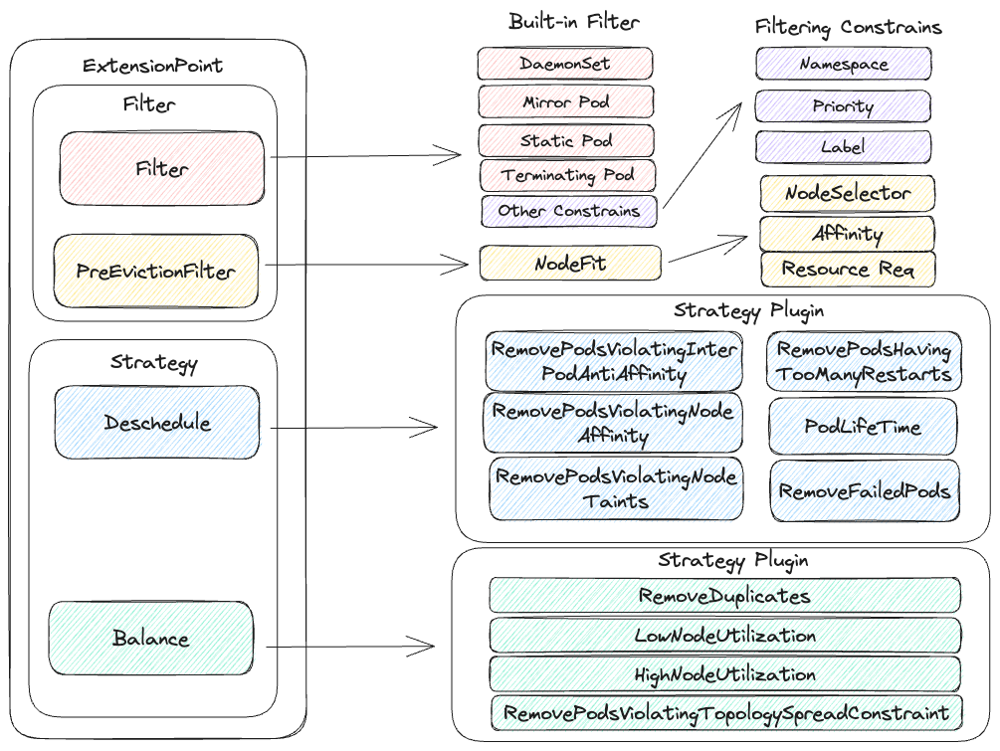

# 初探 Kubernetes Descheduler

本篇文章記錄一下何謂 Kubernetes Descheduler 以及如何透過該專案來平衡 Kubernetes 上運行的服務。

# 使用情境

Kubernetes 提供各種內建資源讓我們有效率地去影響節點的決策，譬如 NodeSelector, NodeAffinity, PodAffinity, Anti-PodAffinity 以及 Pod Topology Spread Constraints，不知道熟悉的讀者是否記得上述用法中會有一個 `requiredDuringSchedulingIgnoredDuringExecution` 的欄位，該欄位的意思就是該決策只有 Scheduler 調度的瞬間才會被影響，當 Pod 已經正式被部署到節點上後這些規則就不會影響，此外如 Taint/Toleration 等概念也都是部署上去後就不影響了。

大部分情況下這種用法並沒有任何問題，但是某些情況下可能會想要去重新分配這些 Pod，譬如新節點加入到叢集時，可能就會發生資源用量不均勻，大部分的 Pod 都坐落於先前的節點，導致資源用量不均。
此外當節點上的 Label 等發生變化時，所有運行的 Pod 都不會被影響，某些情況下可能希望可以根據最新 Label 重新調整。

基本上我們都可以透過主動的去更新或是重新部署這些應用程式來觸發重新調度的情況，而 [Descheduler](https://github.com/kubernetes-sigs/descheduler) 的目的則是提供一個自動化的機制來達成運行期間的重新調度。

# 安裝使用

Deschdeuler 提供不同的方式部署，Job, CronJob 以及 Deployment，其中 Deployment 的部分會透過 Leader Election 的機制來實作 HA 的架構，該架構主要是基於 AP 模式，因為同一時間應該只有一個 deschedule 的決策被執行。

此外該 Server 也有提供 Metrics 供 Prometheus 去收集檢視作為未來除錯使用。

以下示範使用 Helm 來部署安裝，並且開啟 HA 機制

```bash=
$ helm repo add descheduler https://kubernetes-sigs.github.io/descheduler/
```

準備下列 values.yaml
```yaml=
replicas: 3

leaderElection:
  enabled: true

kind: Deployment
```

透過 Helm 安裝
```bash=
$ helm upgrade --install descheduler --namespace kube-system descheduler/descheduler --version=0.28.0 -f values.yaml
```

安裝完畢後先觀察一下系統上的資訊，可以觀察到有三個副本，並且透過 lease 資訊可以知道 `blf4l` 這個 Pod 選舉獲勝。
```bash=
$ kubectl -n kube-system get lease
NAME                                   HOLDER                                                                      AGE
descheduler                            descheduler-845867b84b-blf4l_f48c09d6-2633-4ec5-95aa-d0b62ffe412c           5m9s

$ kubectl -n kube-system get pods -l "app.kubernetes.io/instance"="descheduler"
NAME                           READY   STATUS    RESTARTS   AGE
descheduler-845867b84b-7kv9z   1/1     Running   0          2m15s
descheduler-845867b84b-blf4l   1/1     Running   0          2m15s
descheduler-845867b84b-d4tw7   1/1     Running   0          2m15s
```


# Descheduler 架構

Descheduler 的設定方式主要是由 Policy 組成，而 Policy 則是由 Evictor 與 Strategy 組合而成。

Strategy 用來決定什麼情境下要重新分配 Pod， 而 Evictor 則是用來決定哪些 Pod 有資格被重新分配

## Evictor


Evictor 目前內建兩種機制來處理，分別是 Filter 與 PreEvicitionFilter，

Filter 則是用來過濾哪些 Pod 不會被納入「重新調度」的考慮，譬如
1. Static Pod
2. DaemonSet
3. Terminating Pod
4. 符合 Namespace/Priority/Label 等各種條件

觀看其[程式碼](https://github.com/kubernetes-sigs/descheduler/blob/master/pkg/framework/plugins/defaultevictor/defaultevictor.go#L171-L207)可以觀察到部分規則是寫死，而部分則是會透過 [constraints](https://github.com/kubernetes-sigs/descheduler/blob/master/pkg/framework/plugins/defaultevictor/defaultevictor.go#L65-L147) 來設定。

```golang=
func (d *DefaultEvictor) Filter(pod *v1.Pod) bool {
	checkErrs := []error{}

	if HaveEvictAnnotation(pod) {
		return true
	}

	ownerRefList := podutil.OwnerRef(pod)
	if utils.IsDaemonsetPod(ownerRefList) {
		checkErrs = append(checkErrs, fmt.Errorf("pod is a DaemonSet pod"))
	}

	if utils.IsMirrorPod(pod) {
		checkErrs = append(checkErrs, fmt.Errorf("pod is a mirror pod"))
	}

	if utils.IsStaticPod(pod) {
		checkErrs = append(checkErrs, fmt.Errorf("pod is a static pod"))
	}

	if utils.IsPodTerminating(pod) {
		checkErrs = append(checkErrs, fmt.Errorf("pod is terminating"))
	}

	for _, c := range d.constraints {
		if err := c(pod); err != nil {
			checkErrs = append(checkErrs, err)
		}
	}

	if len(checkErrs) > 0 {
		klog.V(4).InfoS("Pod fails the following checks", "pod", klog.KObj(pod), "checks", errors.NewAggregate(checkErrs).Error())
		return false
	}

	return true
}
```


而 PreEvicitionFilter 目前則實作了關於 "NodeFit" 的機制，則是挑選 Pod 之前也會先判別若將該 Pod 踢除，其本身的 NodeSelector/Affinity/Taint/Request 是否有可用的節點讓 Pod 重新部署。

其實作邏輯可以參考下列[程式碼](https://github.com/kubernetes-sigs/descheduler/blob/master/pkg/framework/plugins/defaultevictor/defaultevictor.go#L154-L169)，當使用者設定時若有設定 "NodeFit=true"，則會進入到主要函式中去檢查當前狀況下是否有節點可以符合當前 Pod 的重新部署。

```golang=
func (d *DefaultEvictor) PreEvictionFilter(pod *v1.Pod) bool {
	defaultEvictorArgs := d.args.(*DefaultEvictorArgs)
	if defaultEvictorArgs.NodeFit {
		nodes, err := nodeutil.ReadyNodes(context.TODO(), d.handle.ClientSet(), d.handle.SharedInformerFactory().Core().V1().Nodes().Lister(), defaultEvictorArgs.NodeSelector)
		if err != nil {
			klog.ErrorS(err, "unable to list ready nodes", "pod", klog.KObj(pod))
			return false
		}
		if !nodeutil.PodFitsAnyOtherNode(d.handle.GetPodsAssignedToNodeFunc(), pod, nodes) {
			klog.InfoS("pod does not fit on any other node because of nodeSelector(s), Taint(s), or nodes marked as unschedulable", "pod", klog.KObj(pod))
			return false
		}
		return true
	}
	return true
}
```


## Strategy

Strategy 的結構主要是 Strategy -> Strategy Plugin，而 **Strategy Plugin** 則是整體演算法的部分，用來決定什麼時候要重新調度 Pod。
這些 **Strategy Plugin** 根據相同用途而分類到相同的 **Strategy**，而目前內建兩種 **Strategy**，分別是 **Deschedule"" 以及 **Balance**。

目前內建 10 種左右的 Strategy Plugin，詳情可以參閱[官方文件](https://github.com/kubernetes-sigs/descheduler#example-policy)，譬如
1. RemoveDuplicates
2. RemovePodsViolatingNodeAffinity
3. RemovePodsHavingTooManyRestarts
4. HighNodeUtilization
5. ... 等等

**Deschedule** 基本上都是針對 Label/Taint/Affinity 等條件來重新調度 Pod，而 **Balance** 則是針對節點使用率或是 Pod 的分佈情形來重新調度 Pod 的分佈情形。

下圖嘗試就上述所有規則整理起來，並且列出每個不同 Filter/Stratey 與之對應的規則與 Strategy Plugin。




# Descheduler Example

Descheduler 的設定只要修改相關 configmap 即可，若採用的是 Helm 安裝的話，則是由 values 的檔案去覆蓋。

這邊要特別注意的是不同 **apiVersion** 的設定方式， Helm 目前預設採用的是 **descheduler/v1alpha1** 而當前最新的是 **descheduler/v1alpha2**。
而[官方文件](https://github.com/kubernetes-sigs/descheduler/tree/96c1c299ebde2f4279b3e0f01e6cf9848a827ca2#policy-default-evictor-and-strategy-plugins)所提供的範例都是基於 **descheduler/v1alpha2**，因此使用上要特別注意不要混用。

修改 values.yaml 為下列內容並且重新部署，該檔案會啟用 **RemovePodsHavingTooManyRestarts** 此 **Strategy Plugin** 並且設定門檻為 5。

```yaml=
replicas: 3

leaderElection:
  enabled: true

kind: Deployment

deschedulerPolicyAPIVersion: "descheduler/v1alpha2"
deschedulerPolicy:
  profiles:
    - name: test
      pluginConfig:
      - name: "RemovePodsHavingTooManyRestarts"
        args:
          podRestartThreshold: 5
          includingInitContainers: true
      plugins:
        deschedule:
          enabled:
            - "RemovePodsHavingTooManyRestarts"
```

接下來部署一個不穩定的 Pod，觀察當 Pod 重啟次數達到 5 次後會發生什麼情況

```yaml=
apiVersion: apps/v1
kind: Deployment
metadata:
  name: www-deployment
spec:
  replicas: 1
  selector:
    matchLabels:
      app: www
  template:
    metadata:
      labels:
        app: www
    spec:
      containers:
        - name: www-server
          image: hwchiu/python-example
          command: ['sh', '-c', 'date && no']
          ports:
            - containerPort: 5000
              protocol: "TCP"

```


由下列日誌可以觀察到，當 Pod 的重啟次數超過5次，也就是第六次後，該 Pod 就被移除同時新的 Pod 就順利部署
```bash=
$ kubectl get pods -w
NAME                              READY   STATUS             RESTARTS      AGE
www-deployment-77d6574796-bhktm   0/1     CrashLoopBackOff   4 (53s ago)   2m37s
www-deployment-77d6574796-bhktm   0/1     Error              5 (92s ago)   3m16s
www-deployment-77d6574796-bhktm   0/1     CrashLoopBackOff   5 (12s ago)   3m28s
www-deployment-77d6574796-bhktm   0/1     CrashLoopBackOff   5 (104s ago)   5m
www-deployment-77d6574796-bhktm   0/1     Terminating        5 (104s ago)   5m
www-deployment-77d6574796-rfkws   0/1     Pending            0              0s
www-deployment-77d6574796-bhktm   0/1     Terminating        5              5m
www-deployment-77d6574796-rfkws   0/1     Pending            0              0s
www-deployment-77d6574796-rfkws   0/1     ContainerCreating   0              0s
www-deployment-77d6574796-bhktm   0/1     Terminating         5              5m
www-deployment-77d6574796-bhktm   0/1     Terminating         5              5m
www-deployment-77d6574796-bhktm   0/1     Terminating         5              5m
www-deployment-77d6574796-bhktm   0/1     Terminating         5              5m

```

同時從 descheduler 內可以觀察到下列日誌明確標示哪個節點上的 Pod 因為什麼理由而被移除
```bash=
I1112 13:08:25.209203       1 descheduler.go:156] Building a pod evictor
I1112 13:08:25.209408       1 toomanyrestarts.go:110] "Processing node" node="kind-control-plane"
I1112 13:08:25.209605       1 toomanyrestarts.go:110] "Processing node" node="kind-worker"
I1112 13:08:25.209648       1 toomanyrestarts.go:110] "Processing node" node="kind-worker2"
I1112 13:08:25.209687       1 toomanyrestarts.go:110] "Processing node" node="kind-worker3"
I1112 13:08:25.209735       1 toomanyrestarts.go:110] "Processing node" node="kind-worker4"
I1112 13:08:25.261639       1 evictions.go:171] "Evicted pod" pod="default/www-deployment-77d6574796-bhktm" reason="" strategy="RemovePodsHavingTooManyRestarts" node="kind-worker4"
I1112 13:08:25.261811       1 profile.go:323] "Total number of pods evicted" extension point="Deschedule" evictedPods=1
I1112 13:08:25.261856       1 descheduler.go:170] "Number of evicted pods" totalEvicted=1

```

[官方文件](https://github.com/kubernetes-sigs/descheduler/tree/96c1c299ebde2f4279b3e0f01e6cf9848a827ca2#policy-default-evictor-and-strategy-plugins) 內還有提供各式各樣不同 Strategy Plugin 的用法，這邊就不贅述重複示範。

# Summary

Descheduler 本身提供一種機制來動態重新部署 Pod，部分策略基於部署條件，譬如 Label/Taint/Affinity 也有部分策略是基於節點使用率來調整，後者的策略可以基於節點的利用量來打散 Pod 的數量或是利用 Cluster Autoscaler 來移除低使用率的節點已達到節省成本的情況。

