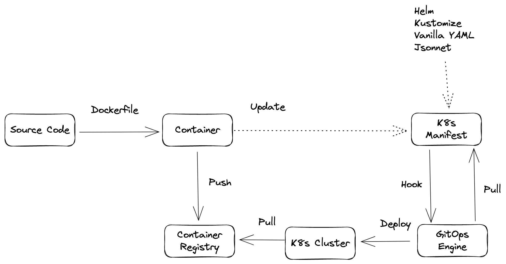
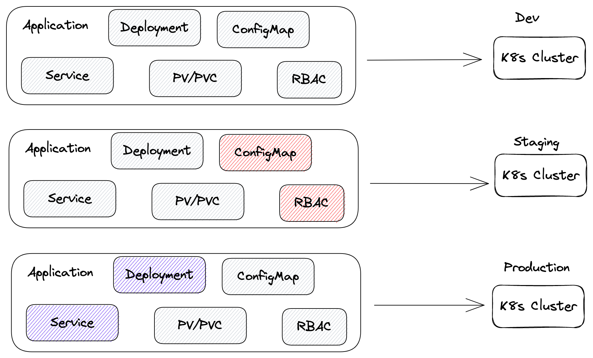
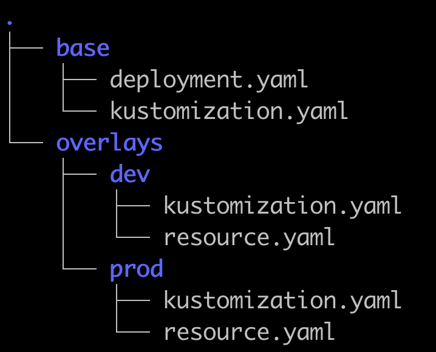
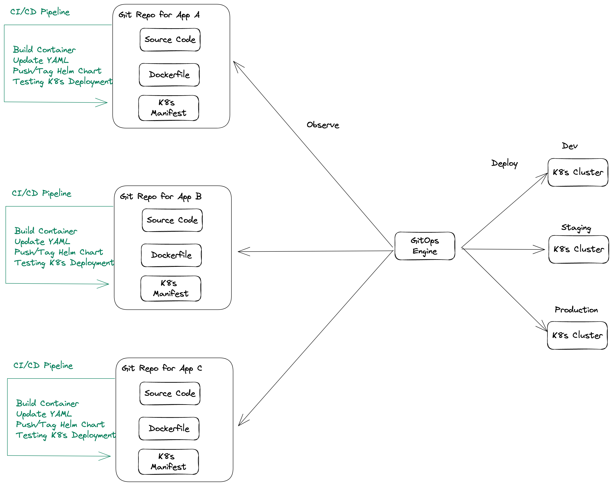
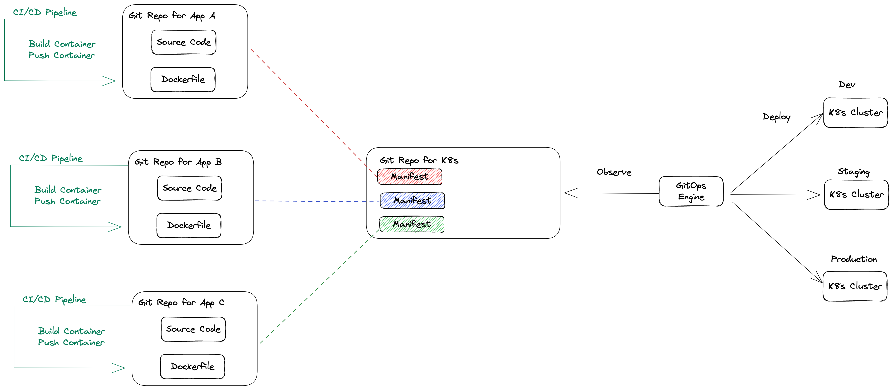
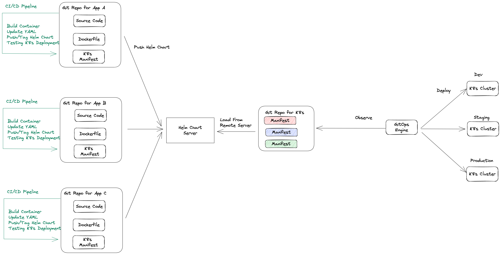

# 前言

隨者 GitOps 的日漸普及，ArgoCD, Flux 等解決方案幫助眾多 Kubernetes 環境解決了 CD 的困境與流程。
然而 GitOps 意味著 Git + Ops，其中 Git 的使用方式則會依環境與團隊而異。
本篇文章嘗試整理幾種可能的使用方式，實務上並沒有一種完美的解決方案，還是要多比較多釐清團隊的需求與能力，打造出適合的方式為主。


# GitOps 挑戰

若以 GitOps 來部署應用程式到 Kubernetes 中，下圖則是一個可能的流程圖




整個流程包含
1. 應用程式的原始碼
2. 容器化後的應用程式
3. 將容器保存於遠方的容器倉庫
4. 同時更新以準備最新的 K8s YAML
5. GitOps 透過 Webhook 或是 Pulling 機制瞭解 YAML 有更動
6. 將更動給更新到目標 Kubernetes 叢集內
7. Kubernetes 更新應用程式，到容器倉庫抓取最新的應用程式

上述的流程看起來直觀且簡單，但是實作起來則會有各種不同的變化，其中有幾個問題是常常被探討的
1. K8S YAML 要用哪套工具來維護? Helm? Kustomize? Jsonnet?
2. Source Code 與 K8s YAML 的歸屬，到底要放到同一個 Git Repo 還是要分開?
3. Container 產生新版後，更新 K8s YAML是誰的責任？是應用程式開發者還是 DevOps 人員？

接下來就針對這三個問題分享一些曾經看過的解法，就如同前述所述，沒有一個完美的解決方案，每個實作方式背後都有被選擇的理由，也許是因為團隊大小，時程壓力..等各種因素。

# K8s Manifest

Kubernetes 資源描述可以基於 YAML 與 JSON 兩種格式，而普遍主流都是基於 YAML 的格式來進行描述，

底下幫大家快速回憶幾個常見的工具，包含
1. Vanilla YAML
2. Helm
3. Kustomize
4. Jsonnet

## Vanilla YAML

直接將所有 Kubernetes 物件以 YAML 格式來描述

優點:
1. 直觀，適合初學者
2. 無需任何工具，準備 YAML 檔案就可以搭配 kubectl 使用

缺點:
1. 缺乏彈性，有任何客製化需求就需要維護多份檔案
2. 沒有版本的概念
3. 部署環境愈多，維護與使用起來愈複雜與麻煩

因為上述原因，很少團隊會直接使用這種方式來管理複雜且多環境的應用程式。
但是有些第三方解決方案會透過這種方式來定義其使用，原因有
1. 使用到的 K8s 物件少，不複雜
2. 專案更專注於應用程式開發，部署部分則由開發者自行處理
3. 透過 Git Branch 的方式來維護不同版本的差異

此種方式也很適合初學者用來學習 K8s 的概念與練習，熟悉概念後再使用接下來的工具去管理才不會太陌生。

以下圖總結來說，每個環境都需要維護一整份近乎一樣的一群檔案，維護上非常困難



## Helm

[Helm](https://helm.sh/) 可以說是目前 Kubernetes 應用程式定義最知名的工具之一，透過 Helm Chart 與 Go Template 等機制讓你可以更輕鬆的根據環境客製化部署資源。

優點：
1. 基於 Go Template 來動態產出最後的 k8s 資源
2. 可打包成一個容易散佈與安裝的格式，並且支援版本控制
3. 支援 Dependency 概念，可以組合出 Umbrella Chart
4. 生態系豐富，眾多第三方專案都有支援 Helm Chart 的安裝，因此學會 Helm 對於使用這些專案會較少阻力

缺點:
1. 學習曲線偏高，Template 的語法可能過於複雜
2. 需要額外安裝 Helm 指令使用
3. 有可能還需要額外維護 Helm Chart Server


Helm 的特性使得團隊只需要針對主體維護一份檔案，針對不同的部署環境準備相對應的 **values.yaml** 就可以動態的產生出符合各環境需求的 K8s 物件，整個流程如下


Helm Chart 本身除了本地直接載入使用外，也可以將其打包並且發佈到 Helm Chart 伺服器 去，其本質基本上就是一個 web 伺服器，目前稍微有些規模的開源專案也都會透過這種方式來發布自己專案的 Helm Chart，因此使用者就可以很輕易地選擇所需要的版本並且搭配 values.yaml 來客製化，整個流程類似下圖


此外，有些團隊所開發且交付的不單純只是一個應用程式，而是一個由眾多應用程式所組合而成的服務，這種需求下會採用 Umbrella Chart 的方式，其概念非常簡單
1. 交付與部署的不是一個應用程式，而是一個完整的服務
2. 該 Umbrella Helm Chart 實務上會依賴許多更多 Helm Chart
3. 部署該 Helm Chart 會一併把所有被依賴的 Helm Chart 一併部署
4. Umbrella Helm Chart 的 Values.yaml 會龐大且複雜，可以動態決定哪些依賴需要安裝，同時也可以將設定之參數給傳遞過去

範例如下圖，整個環境中有 `5` 個 Helm Chart，其中有一個主要的 Helm Chart 會透過 [helm dependency](https://helm.sh/docs/helm/helm_dependency/) 來連結 Helm Chart{A/B/C/D}。
使用者只需要準備一個 Values.yaml 並且部署該 Umbrella Chart 即可順利的把整套服，四個 Helm Chart 都一併部署到目標叢集內。


## Kustomize

不同於 Helm 使用 Template 的方式，[Kustomize](https://kustomize.io/) 提供更為簡單與乾淨的方式來達到客製化 Kubernetes 資源物件，所有檔案都會維持 K8s 原生的格式，透過 Patch 等疊加的概念來動態修改資源內容。

優點：
1. 基於原生 YAML 格式，沒有任何 Template 等語法要學習
2. 已經整合至 kubectl 中，可以不需要安裝額外指令
3. 透過疊加與覆蓋的方式來

缺點：
1. 生態性不如 Helm 豐富
2. 沒有版本概念，不方便散佈給不同使用者與客戶
3. 雖然沒有 Template，但是整體架構與使用方式還是需要學習

以下例範例來說，我們會於 base 資料夾內準備我們應用程式的基本物件，接者每個環境資料夾內則會準備想要客製化的內容，最後這一切都會依照 kustomization.yaml 的內容全部串連起來。



過往需要使用 **kustomize** 這個指令，現在已經整合到 kubectl 中，所以可以直接使用 **kubectl apply -k** 的方式來操作基於 kustomize 的部署格式。


## Jsonnet

Jsonnet 則是一種基於 JSON 格式的程式語言，所有的操作都是基於 JSON 並且最後輸出也是 JSON 格式，而前面也有提到 Kubernetes 也接受基於 JSON 格式來描述所有資源狀況，因此也有部分人會採用這種方式來維護 K8s 應用程式。

簡單來說，就是利用程式語言撰寫的習性來產生 K8s 的物件描述檔案

優點
1. 支援 if/else, 迴圈, function 等程式語言常見的邏輯
2. 支援 library 的概念減少重複撰寫程式碼

缺點:
1. 要學習全新工具 jsonnet
2. 文件與生態性不夠豐富


Jsonnet 本身是針對 Json 物件操作，而 [jsonnet k8s](https://github.com/jsonnet-libs/k8s)與 [k8s-libsonnet](https://github.com/jsonnet-libs/k8s-libsonnet) 則是實作各種介面讓你可以快速產生適合各種版本 Kubernetes 的物件資源。

舉例來說，下列的語法最後可以產生出一個 k8s deployment + service 的物件，這些檔案都可以被重複利用，還可以被動態覆蓋，整體來說彈性非常高
```jsonnet=
local k = import "vendor/1.27/main.libsonnet";

local s= {
  name: "demo",
};

[
   k.apps.v1.deployment.new(name="demo", containers=[
     k.core.v1.container.new(name="demo", image="hwchiu/netutils")
   ]),
   k.core.v1.service.new("demo", s, 5000)
]
```

```shell=
azureuser@course:~/jsonnet$ jsonnet --yaml-stream main.jsonnet
---
{
   "apiVersion": "apps/v1",
   "kind": "Deployment",
   "metadata": {
      "name": "demo"
   },
   "spec": {
      "replicas": 1,
      "selector": {
         "matchLabels": {
            "name": "demo"
         }
      },
      "template": {
         "metadata": {
            "labels": {
               "name": "demo"
            }
         },
         "spec": {
            "containers": [
               {
                  "image": "hwchiu/netutils",
                  "name": "demo"
               }
            ]
         }
      }
   }
}
---
{
   "apiVersion": "v1",
   "kind": "Service",
   "metadata": {
      "name": "demo"
   },
   "spec": {
      "ports": [
         5000
      ],
      "selector": {
         "name": "demo"
      }
   }
}
```

整個流程大致上如下，撰寫各種 jsonnet 的檔案，最後透過 jsonnet 指令產生出符合 K8s 需求的檔案，接者使用 kubectl 指令將其 Apply 到目標叢集。


## Tools

上述四種工具沒有絕對的好壞且 ArgoCD 都支援，所以只要其特性與優缺點符合團隊所需，事實上都可以嘗試使用。

實務上更多可能概念則是混用，畢竟現在太多開源專案都是基於 Helm 去發布，而團隊可能採用 Kustomize/Jsonnet 的方式來管理自己的應用程式，所以實際上這些不同方式可能會同時存在，反正 ArgoCD 都支援都可以部署，唯一的問題則是使用者要有相關的背景知識來使用，除錯與設定。


# Git Repo

從 Source Code 與 K8s Manifest 的角度來看，常見有兩種選擇
1. 每一個應用程式有一個專屬的 Git Repo，含有該應用程式的 Source Code , Dockerfile 以及 K8s 相關物件檔案
2. 每一個應用程式有一個專屬的 Git Repo，含有該應用程式的 Source Code 與 Dockerfile。另外會有一個專屬的 Git Repo 包含所有應用程式所需要的 K8s 物件檔案。


## Code/YAML in the Same Repo
第一種概念如下


這種模式下的特性有
1. 從應用程式開發到 K8s 的部署所有資源都放一起，容易查閱彼此關聯
2. 如果應用程式有任何需求修改，可以連部署 YAML 一起修改，譬如新增某個環境變數的讀取。
3. CI/CD Pipeline 可處理所有事情，甚至可以搭配 KIND 等架構來測試 K8s 部署
4. 如果採用 Helm Chart 的話，可於 CI/CD pipeline 流程中一起打包並且發布
5. 如果要採用 jsonnet/kustomize 的方式來處理，則跨應用共享的檔案就不方便處理
6. 可透過 Git branch/tag 的方式來控制版本
7. 維運人員很難輕鬆的瞭解到系統上全面使用的部署方式與內容，必須要每個 Git repo 逐步查找

此外，採用這種模型也很常面對如何處理 image tag 的問題
舉例來說
1. 開發者開啟一個 PR 加入新功能
2. 由於使用者並不知道最後產生的 container image tag，因此無法同時更新 K8s YAML 檔案

常見的解法包含
1. 永遠都使用 latest tag 來部署應用程式
2. 開啟第二個 PR 來更新
3. 創建一個 GitHub App 來動態更新 PR 內容

因此流程實作上還是有很多細節需要考慮與探討，並沒有想像中的這麼完美簡單。

## Code/YAML in the Different Repo

更多常見的作法則是第二種，權責分離，讓開發人員專心處理自己應用程式的開發與容器化，而準備一個專屬的 Git Repo 來處理所有 GitOps 的管理與部署

基本概念如下圖


這種架構上常見的特性有
1. 所有部署物件都放一起，容易查閱快速理解所有部署的差異性
2. 與應用程式的開發分離，更方便讓開發人員與維運人員分別處理
3. 若應用程式新版本有任何功能增減需要 YAML 配合，需要到此 Repo 額外處理，不能一次搞定
4. 由於環境都放一起，kustomize/jsonnet 等概念就相對容易共享
5. 可透過 Branch/Folder 等方式來區分不同環境的部署資源
6. 可有專屬的 CI/CD Pipeline 來驗證整體服務的部署，而非單一應用程式

以 Kustomize 或 Jsonnet 為基底的，很常看到下列的資料結構，透過資料夾來區分不同環境的部署，若有特別的需求還可以搭配 Git tag 的方式來定版，以便未來需要追蹤某個版本部署的內容。

```
├── base
│   ├── foo
│   │   ├── deployment.yaml
│   │   ├── kustomization.yaml
│   │   └── service.yaml
│   └── foo2
│       ├── deployment.yaml
│       ├── kustomization.yaml
│       └── service.yaml
└── overlays
    ├── dev
    │   ├── foo
    │   │   ├── kustomization.yaml
    │   │   └── resource.yaml
    │   └── foo2
    │       ├── kustomization.yaml
    │       └── resource.yaml
    └── prod
        ├── foo
        │   ├── kustomization.yaml
        │   └── resource.yaml
        └── foo2
            ├── kustomization.yaml
            └── resource.yaml
```


```
├── base
│   ├── app
│   │   ├── foo
│   │   │   └── app.jsonnet
│   │   └── foo2
│   │       └── app.jsonnet
│   └── component
│       ├── deployment.jsonnet
│       └── service.jsonnet
└── env
    ├── production
    │   ├── foo
    │   │   ├── env.jsonnet
    │   │   └── main.jsonnet
    │   └── foo2
    │       ├── env.jsonnet
    │       └── main.jsonnet
    └── staging
        ├── foo
        │   ├── env.jsonnet
        │   └── main.jsonnet
        └── foo2
            ├── env.jsonnet
            └── main.jsonnet

```

此外，由於 [Kustomize](https://github.com/kubernetes-sigs/kustomize/blob/master/examples/chart.md) 目前也支援使用 Helm Chart 來部署，所以也有可能會看到如下列的變化行，將 Kustomize 與 Helm 給組合一同使用。

```
├── base
│   ├── foo
│   │   ├── deployment.yaml
│   │   ├── kustomization.yaml
│   │   └── service.yaml
│   └── foo2
│       ├── deployment.yaml
│       ├── kustomization.yaml
│       └── service.yaml
├── helm
│   └── app
│       ├── charts
│       ├── Chart.yaml
│       ├── templates
│       │   ├── deployment.yaml
│       │   ├── _helpers.tpl
│       │   ├── hpa.yaml
│       │   ├── ingress.yaml
│       │   ├── NOTES.txt
│       │   ├── serviceaccount.yaml
│       │   ├── service.yaml
│       │   └── tests
│       │       └── test-connection.yaml
│       └── values.yaml
└── overlays
    ├── dev
    │   ├── foo
    │   │   ├── kustomization.yaml
    │   │   └── resource.yaml
    │   └── foo2
    │       ├── kustomization.yaml
    │       └── resource.yaml
    └── prod
        ├── foo
        │   ├── kustomization.yaml
        │   └── resource.yaml
        └── foo2
            ├── kustomization.yaml
            └── resource.yaml
```


## Mixed 

由於 Helm Chart 本身可以打包並且推向 Helm Chart Server，因此採用 Helm Chart 的方式更可能看到兩者結合的結果，如下圖。



這種情況下的特性有
1. 應用程式 Repo 只專心維護 Helm Chart 的發佈與設定
2. 應用程式 Repo 會透過 CI/CD 來打包 Helm Chart 並且推向到 Helm Chart Server
3. K8s YAML Repo 內則透過 Helm Chart 指向遠方的 Helm Chart Server 來抓取建置好的檔案，並且搭配不同的 values 來部署到不同環境
4. 保留分離 Repo 的特性，職權分離，各自有各自的 Git 流程來管理

由於該架構通常需要一個額外的 Helm Chart Server，這部分因為 Helm Chart v3 支援 OCI 格式，所以可以採用支援 OCI 的 Container Registry，如 ECR, Harbor 等，或是繼續使用傳統的 [Chart Museum](https://github.com/helm/chartmuseum) 來部署。

# Image Updater
採用第二與第三兩種架構下，很多團隊都會探討提升工作流程，特別是當 Container Image 有新版本時，要如何自動更新該 Repo 下的描述檔案。

有的團隊會採用 [Argo Image Updater](https://argocd-image-updater.readthedocs.io/en/stable/) 或是自行撰寫 CI/CD 流程來更新。

# Summary

1. 本篇文章總結了 GitOps 架構下常見的 Git 結構問題，探討了常見的工具與使用方式
2. K8s 的應用程式可以採用原生 YAML, Helm, Jsonnet, Kustomize 等方式來管理，不同方式有各自不同的特性以及適合的場景
3. 沒有一個完美的解法，所有規劃還是要以團隊規模，流程，能力，以及工作等來討論適合的工具

