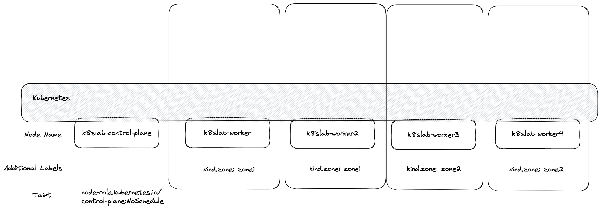
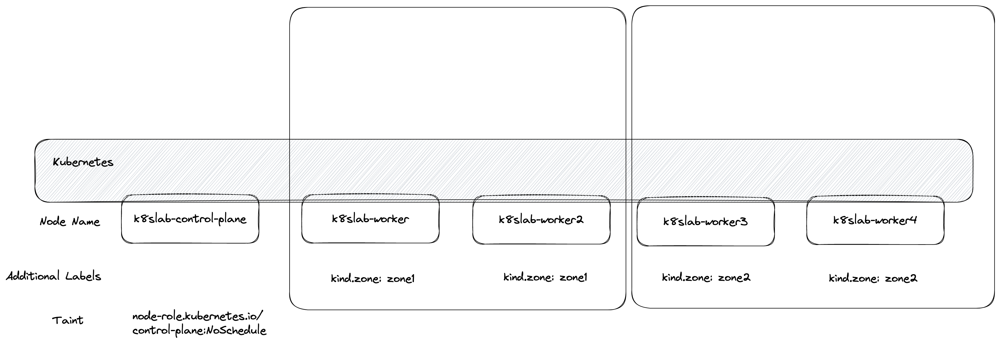
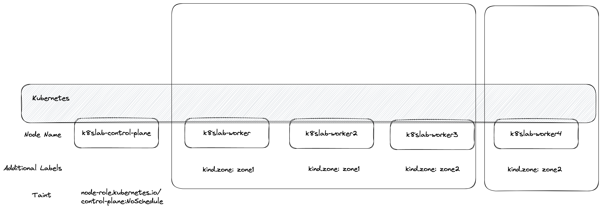
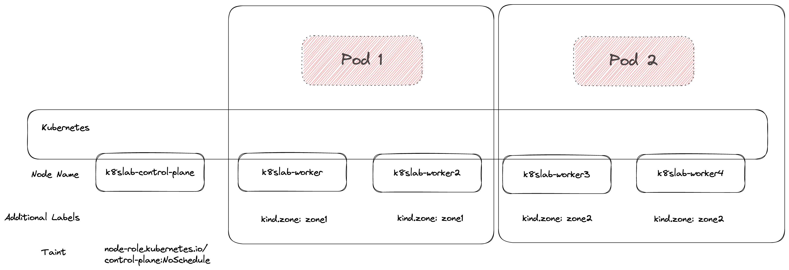
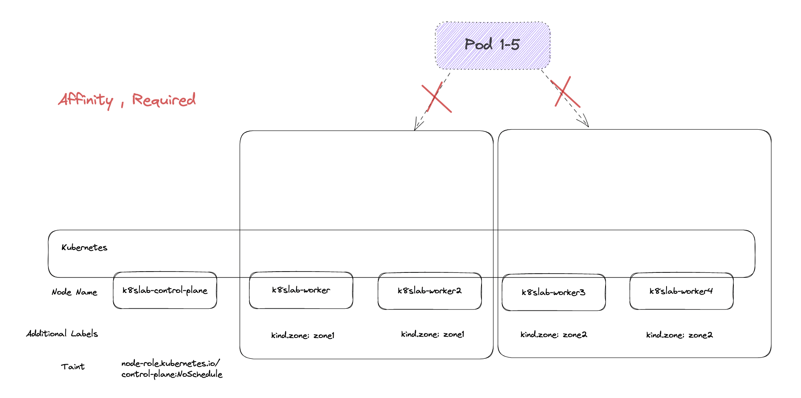
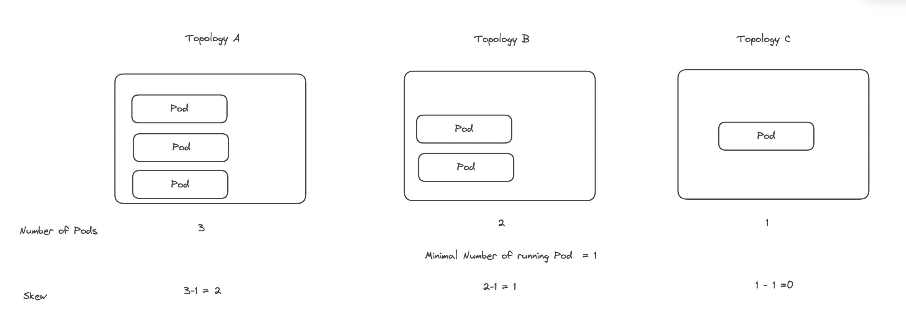

本篇文章要來探討 Kubernetes 中有哪些方式可以用來影響 Pod 與 Node 之間的分配關係。

對環境與前述章節不熟的請先前往閱讀前篇文章 [解密 Assigning Pod To Nodes(上)](https://www.hwchiu.com/k8s-assigning-pod.html)

# Inter-Pod (Anti)Affinity

Inter-Pod Affinity 與 Anti-Affinity 讓使用者根據已在節點上運行的 Pod 的標籤而非 Node 本身的標籤來限制 Pod 可以被調度到哪些節點上。

所以比較對方已經不單單是 Node 而是 Pod 的標籤。

而實作上更為精準的說法，其判斷與調度的目標對象並不是節點，而是一個分群後的結果

舉例來說，我們可以有下列不同的分群結果





分群的方式則是透過 Node 上的 label，透過 key/value 的形式將相同 value 的節點給歸類為同一群體，而 Key 的選擇則是透過 "topologyKey" 這個欄位來設定

舉例來說，如果今天設定
topologyKey = `kubernetes.io/hostname`，則就會基於節點的 hostname 來分群，那因為沒有節點有一樣的名稱，所以四個節點就會自動分成四群，如上圖一
但是若採用
topologyKey = `kind.zone`，則就會基於 `kind.zone` 的方式去分群，所以分群的結果就會如同上圖二所示，最後分成兩群。

因此使用 Inter-Pod (Anti)Affinity 時還要先考慮如何將節點分群，常見的方法有
1. 以節點的名稱分群
2. 以Zone的分群，特別是雲端環境中希望服務可以部署到不同的 Zone 來達到高可用性。

這邊要注意的是，官網有提到若有部分節點沒有 `topoologyKey` 所描述的 Key 那可能會造成些非預期的行為，因此一定要確保所有節點都有對應的 Label key。

與 NodeAffinity 相似， Inter-Pod Affinity 也提供基於 "Required" 與 "Preferred" 兩種不同的選擇策略，因此設定上的邏輯與格式幾乎完全雷同，幾個唯一的差異是
```bash=
$ kubectl explain pod.spec.affinity.podAffinity.requiredDuringSchedulingIgnoredDuringExecution
KIND:     Pod
VERSION:  v1

RESOURCE: requiredDuringSchedulingIgnoredDuringExecution <[]Object>

DESCRIPTION:
     If the affinity requirements specified by this field are not met at
     scheduling time, the pod will not be scheduled onto the node. If the
     affinity requirements specified by this field cease to be met at some point
     during pod execution (e.g. due to a pod label update), the system may or
     may not try to eventually evict the pod from its node. When there are
     multiple elements, the lists of nodes corresponding to each podAffinityTerm
     are intersected, i.e. all terms must be satisfied.

     Defines a set of pods (namely those matching the labelSelector relative to
     the given namespace(s)) that this pod should be co-located (affinity) or
     not co-located (anti-affinity) with, where co-located is defined as running
     on a node whose value of the label with key <topologyKey> matches that of
     any node on which a pod of the set of pods is running

FIELDS:
   labelSelector        <Object>
     A label query over a set of resources, in this case pods.

   namespaceSelector    <Object>
     A label query over the set of namespaces that the term applies to. The term
     is applied to the union of the namespaces selected by this field and the
     ones listed in the namespaces field. null selector and null or empty
     namespaces list means "this pod's namespace". An empty selector ({})
     matches all namespaces.

   namespaces   <[]string>
     namespaces specifies a static list of namespace names that the term applies
     to. The term is applied to the union of the namespaces listed in this field
     and the ones selected by namespaceSelector. null or empty namespaces list
     and null namespaceSelector means "this pod's namespace".

   topologyKey  <string> -required-
     This pod should be co-located (affinity) or not co-located (anti-affinity)
     with the pods matching the labelSelector in the specified namespaces, where
     co-located is defined as running on a node whose value of the label with
     key topologyKey matches that of any node on which any of the selected pods
     is running. Empty topologyKey is not allowed.
```

```bash=
$ kubectl explain pod.spec.affinity.podAffinity.preferredDuringSchedulingIgnoredDuringExecution.podAffinityTerm
KIND:     Pod
VERSION:  v1

RESOURCE: podAffinityTerm <Object>

DESCRIPTION:
     Required. A pod affinity term, associated with the corresponding weight.

     Defines a set of pods (namely those matching the labelSelector relative to
     the given namespace(s)) that this pod should be co-located (affinity) or
     not co-located (anti-affinity) with, where co-located is defined as running
     on a node whose value of the label with key <topologyKey> matches that of
     any node on which a pod of the set of pods is running

FIELDS:
   labelSelector        <Object>
     A label query over a set of resources, in this case pods.

   namespaceSelector    <Object>
     A label query over the set of namespaces that the term applies to. The term
     is applied to the union of the namespaces selected by this field and the
     ones listed in the namespaces field. null selector and null or empty
     namespaces list means "this pod's namespace". An empty selector ({})
     matches all namespaces.

   namespaces   <[]string>
     namespaces specifies a static list of namespace names that the term applies
     to. The term is applied to the union of the namespaces listed in this field
     and the ones selected by namespaceSelector. null or empty namespaces list
     and null namespaceSelector means "this pod's namespace".

   topologyKey  <string> -required-
     This pod should be co-located (affinity) or not co-located (anti-affinity)
     with the pods matching the labelSelector in the specified namespaces, where
     co-located is defined as running on a node whose value of the label with
     key topologyKey matches that of any node on which any of the selected pods
     is running. Empty topologyKey is not allowed.
```

1. 需要透過 `topologyKey` 來指定如何分群節點
2. 由於決策是基於 Pod 的 Label 來決定，而 Pod 本身實際上是有 namespace 的概念的，預設情況下只會比較相同 namespace 的 Pod，如果有特別需求的時候還要使用 namespaceSelector 或是 namespace 來選定目標 namespace，則這些 namespace 上的所有 Pod 都會被納入考量


此外 Anti-Affinity 與 Affinity 實作上有一些關於對稱性的差異，詳細來源為[官方設計文件](https://github.com/kubernetes/design-proposals-archive/blob/main/scheduling/podaffinity.md#a-comment-on-symmetry?WT.mc_id=AZ-MVP-5003331)

對 Anti-Affinity 來說，若服務 A 不想要與服務 B 被調度一起，則隱含服務 B 也不想要跟服務A 一起，但是對 Affinity 來說則沒有這種對稱性，所以兩者部署的演算法有些許不同，以下節錄自[官方設計文件](https://github.com/kubernetes/design-proposals-archive/blob/main/scheduling/podaffinity.md#a-comment-on-symmetry?WT.mc_id=AZ-MVP-5003331)

Anti-Affinity
```
if S1 has the aforementioned RequiredDuringScheduling anti-affinity rule
    if a node is empty, you can schedule S1 or S2 onto the node
    if a node is running S1 (S2), you cannot schedule S2 (S1) onto the node
```
這意味如果今天有服務 A 透過 Anti-Affinity 去限制與 B 的調度情況，則部署服務 A 或是服務 B 都會去檢查是否有違反規則，沒有的話則隨意部署。

Affintiy
```
if S1 has the aforementioned RequiredDuringScheduling affinity rule
    if a node is empty, you can schedule S2 onto the node
    if a node is empty, you cannot schedule S1 onto the node
    if a node is running S2, you can schedule S1 onto the node
    if a node is running S1+S2 and S1 terminates, S2 continues running
    if a node is running S1+S2 and S2 terminates, the system terminates S1 (eventually)
```
相同範例來看，服務 A 透過 Affinity 去要求與服務 B 一起的調度情況，根據第二條規則，若服務 B 不存在，則服務 A 會卡住不能調度，處於 Pending 狀況。

## Anti-Affinity 
第一個範例嘗試透過 `required` 來限制部署情況，而參照對象為自己

```yaml=
apiVersion: apps/v1
kind: Deployment
metadata:
  name: pod-affinity-1
spec:
  replicas: 3
  selector:
    matchLabels:
      app: pod-affinity-1
  template:
    metadata:
      labels:
        app: pod-affinity-1
    spec:
      containers:
        - name: www-server
          image: hwchiu/netutils
      affinity:
        podAntiAffinity:
          requiredDuringSchedulingIgnoredDuringExecution:
          - labelSelector:
              matchExpressions:
              - key: app
                operator: In
                values:
                - pod-affinity-1
            topologyKey: "kind.zone"
```

1. 基於 `kind.zone` 作為 TopologyKey 
2. 使用 `AntiAffinity` 配上 Required，要求同 ToplogyKey 中彼此不能出現第二個 Pod
3. 部署三個副本

根據前述對稱性所描述的規則，若當下環境沒有任何符合規則的 Pod，則可以隨意部署，所以第一個 Pod 可以順利部署。


第二個 Pod 部署的時候就會觀察到 Pod1 已經把左邊給佔據了，因此只剩下右邊該群可用



第三個 Pod 部署的時候因為兩個群上面都已經有 Pod 正在運行，而環境中沒有任何其他符合條件的節點可以用，因此最終就會卡到 Pending.


由結果可以觀察根據 `TopologyKey=kind.zone` 來分類，叢集中只能分到兩群，而第三個 Pod 則會因為 AntiAffinity + Required 的效果因此沒有辦法被部署，所以這種使用方法就要特別注意副本數量與分群數量，特別是當透過 HPA 來動態調整副本時更容易出錯。

若將 `Rqeuired` 改成 `Prefer` 的概念的話，則可以達到一樣將 Pod 給分散同時又不會出現 Pending 的狀況，因為此時的條件不是硬性規定，而是參考而已，所以前面兩個 Pod 都會盡量分散，而第三個 Pod 依然有能力被調度。

這時候得到的結果可能會是如下圖


第二個範例準備兩個檔案，模擬服務 A 與 B 彼此之間的 Anti-Affinity 設定

```yaml=
apiVersion: apps/v1
kind: Deployment
metadata:
  name: pod-affinity-3
spec:
  replicas: 3
  selector:
    matchLabels:
      app: pod-affinity-3
  template:
    metadata:
      labels:
        app: pod-affinity-3
    spec:
      containers:
        - name: www-server
          image: hwchiu/netutils
      affinity:
        podAntiAffinity:
          requiredDuringSchedulingIgnoredDuringExecution:
          - labelSelector:
              matchExpressions:
              - key: app
                operator: In
                values:
                - pod-affinity-4
            topologyKey: "kind.zone"
```

該範例繼續使用 Anti-Affinity + required 的方式來限制，不過這次的參照對象是別的服務 `pod-affinity-4`，而環境中目前沒有這個服務出現

部署上不會出現問題，所有的 Pod 都可以正常運行，接者我們嘗試部署一個沒有任何 Affinity 的 `pod-affinity-4` 服務

```yaml=
apiVersion: apps/v1
kind: Deployment
metadata:
  name: pod-affinity-4
spec:
  replicas: 1
  selector:
    matchLabels:
      app: pod-affinity-4
  template:
    metadata:
      labels:
        app: pod-affinity-4
    spec:
      containers:
        - name: www-server
          image: hwchiu/netutils
```

可以觀察到這時候 pod-affinity-4 這個服務卻卡 Pending 了


透過 `kubectl describe` 可以看到原因為是因為不滿足當下運行 Pod 的 Anti-Affinity。


這也是設計文件中所描述的對稱性，因此即使後續服務沒有特別撰寫 Anti-Affinity，其調度的過程中也會根據當下其他 Pod 的資訊來判別是否可以調度

## Affinity

接下來基於相同概念來測試 Affinity，服務 A 依賴於 服務 B(pod-affinity-6)
```yaml=
apiVersion: apps/v1
kind: Deployment
metadata:
  name: pod-affinity-5
spec:
  replicas: 5
  selector:
    matchLabels:
      app: pod-affinity-5
  template:
    metadata:
      labels:
        app: pod-affinity-5
    spec:
      containers:
        - name: www-server
          image: hwchiu/netutils
      affinity:
        podAffinity:
          requiredDuringSchedulingIgnoredDuringExecution:
          - labelSelector:
              matchExpressions:
              - key: app
                operator: In
                values:
                - pod-affinity-6
            topologyKey: "kind.zone"
```

與 `Anti-Affinity` 不同，若當下找不到目標服務， `Affinity` 則會卡在 Pending 的狀況，沒有辦法部署。


註: 若參考對象是自己則為特殊情況，不會有 Pending 的情況發生，否則會有 deadlock 的情形出現。


接下來部署服務 B
```yaml=
apiVersion: apps/v1
kind: Deployment
metadata:
  name: pod-affinity-6
spec:
  replicas: 1
  selector:
    matchLabels:
      app: pod-affinity-6
  template:
    metadata:
      labels:
        app: pod-affinity-6
    spec:
      containers:
        - name: www-server
          image: hwchiu/netutils
```

部署下去後可以觀察到服務 A 與 B 幾乎同時順利完成調度的決策，一起被分配到相同的 kind.zone 內


以過程中來說，最初的服務 A 因為找不到服務 B 可以匹配，所以全部卡 Pending 的狀況


而服務 B 本身沒有描述任何 Affinity 的規則，因此本身順利被調度


當服務 B 被調度到 kind.zone=zone1 後，所有卡住的服務 A 就有參照對象可以比較，所已全部 Pod 就直接部署上去了。


# PodTopologySpread

前述所探討的 NodeAffinity 以及 Inter-Pod (Anti)Affinity 可以滿足許多人控制 Pod 調度的需求，然而實際使用上會遇到一些問題
1. 透過 NodeAffinity 並沒有保證 Pod 可以均勻的分散到各節點上，有可能會遇到分佈不均勻的情況 ([66981](https://github.com/kubernetes/kubernetes/issues/68981?WT.mc_id=AZ-MVP-5003331
))
2. Inter-Pod Anti Affinity 碰到 Deployment rolling upgrade 時會出問題，新的 Pod 要先被創立但是因為 Anti-Affinity 的限制導致沒有節點可用，所以新版本的 Pod 就會處於 Pending 而整個 Deployment 更新就會卡死 [40358](https://github.com/kubernetes/kubernetes/issues/40358?WT.mc_id=AZ-MVP-5003331)

因為上述問題所以就有了 [Pod Topology Spread](https://github.com/kubernetes/enhancements/tree/master/keps/sig-scheduling/895-pod-topology-spread#motivation) 的發展，而整個 `Pod Topology Spread` 中最重要的一個因素就稱為 Skew，該數值是用來處理 Pod 分配不均勻的問題，其定義為。

skew = Pods number matched in current topology - min Pods matches in a topology


`PodTopologySpread` 每次分配 Pod 的時候都會針對每個節點計算當下的 Skew 數值並且以數值來影響調度的決策。


以下圖為範例



1. `topologyKey` 將節點分成三群
2. 每個群上面目前運行的 Pod 數量分別為 `3,2,1`
3. 群中最少的運行 Pod 數量為 1
4. 分別計算可以得到每群對應的 Skew 數值為 2,1,0


下列是透過 `kubectl explain` 得到的欄位介紹，由於篇幅過程所以只保留重點欄位，實際上還有很多選項不過部分選項即使到 v1.26 都還是 Beta 測試

```bash=
$ kubectl explain pod.spec.topologySpreadConstraints
KIND:     Pod
VERSION:  v1

RESOURCE: topologySpreadConstraints <[]Object>

DESCRIPTION:
     TopologySpreadConstraints describes how a group of pods ought to spread
     across topology domains. Scheduler will schedule pods in a way which abides
     by the constraints. All topologySpreadConstraints are ANDed.

     TopologySpreadConstraint specifies how to spread matching pods among the
     given topology.

FIELDS:
   labelSelector        <Object>
     LabelSelector is used to find matching pods. Pods that match this label
     selector are counted to determine the number of pods in their corresponding
     topology domain.

   maxSkew      <integer> -required-
     MaxSkew describes the degree to which pods may be unevenly distributed.
     required field. Default value is 1 and 0 is not allowed.


   topologyKey  <string> -required-
     TopologyKey is the key of node labels. Nodes that have a label with this
     key and identical values are considered to be in the same topology. We
     consider each <key, value> as a "bucket", and try to put balanced number of
     pods into each bucket. 

   whenUnsatisfiable    <string> -required-
     WhenUnsatisfiable indicates how to deal with a pod if it doesn't satisfy
     Possible enum values:
     - `"DoNotSchedule"` instructs the scheduler not to schedule the pod when
     constraints are not satisfied.
     - `"ScheduleAnyway"` instructs the scheduler to schedule the pod even if
     constraints are not satisfied.
```

1. maxSkew 則是用來控制 skew 的上限值，若 Pod 部署到該節點後會使得 Skew 超過此限制，則該節點就會被跳過
2. topologyKey 如同 Inter-Pod 的設定，用來判定如何分類節點
3. whenUnsatisfiable 則是用來設定當 maxSkew 找不到任何符合規則節點時該怎處理，可以卡在 Pending 狀態或是就忽略當前設定按照其他設定部署
4. labelSelector 則是用來選擇要把哪些 Pod 的數量納入考慮


因此使用上很常透過下列方式讓 Pod 可以均勻地散落到不同的 Zone 內
```yaml=
spec:
  containers:
    - name: www-server
      image: hwchiu/netutils
  topologySpreadConstraints:
  - maxSkew: 1
    topologyKey: kind.zone
    whenUnsatisfiable: DoNotSchedule
    labelSelector:
      matchLabels:
        app: pod-ts-1
```

如果要細部調整現在還有下列參數可以使用，使用前請參閱[官方文件](https://kubernetes.io/docs/concepts/scheduling-eviction/topology-spread-constraints/#example-one-topologyspreadconstraint)
1. nodeAffinityPolicy: [Honor|Ignore]
2. nodeTaintsPolicy: [Honor|Ignore]
3. matchLabelKeys: list
4. minDomains: integer

# Summary
    
本系列文探討如何透過 Kubernetes 內建的方式來影響 Scheduler 調度的決策，這類型的設定能夠於 Zone/Region 等架構下達到更好的高可用性設定，此外若 Pod 之間有強烈依賴且希望網路延遲盡可能低的，也可以考慮用這類型的設定來處理。
    
使用上請務必確保理解每個欄位的意思，特別是當參數本身為 List 型態的時候，要確認一下其結果是基於 OR 或是 AND 的運算，以免發生結果與預期不符導致花費太多時間除錯。

