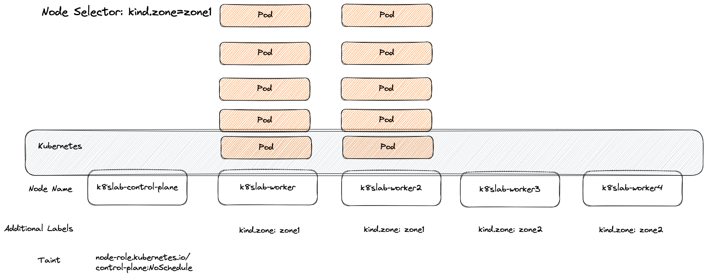
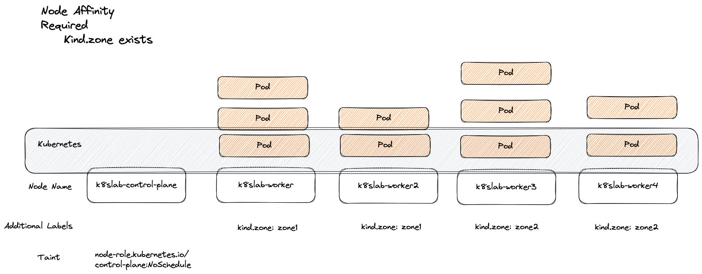
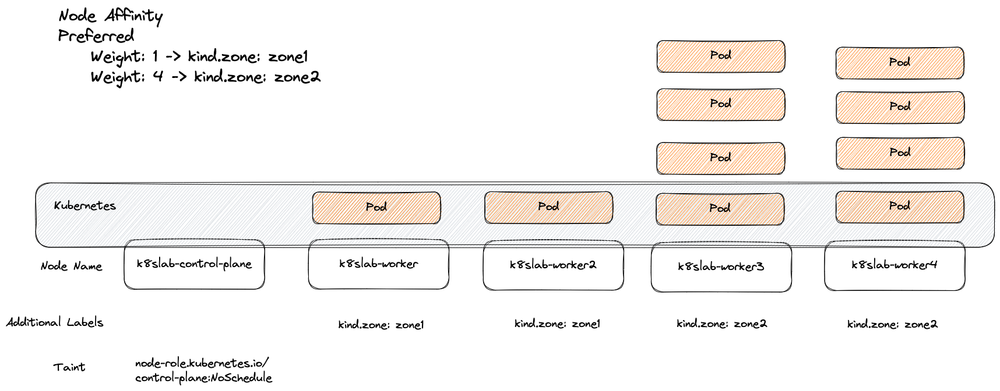
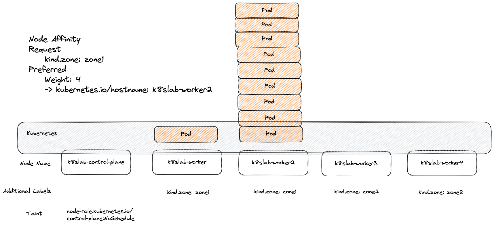

# Preface
本篇文章要來探討 Kubernetes 中有哪些方式可以用來影響 Pod 與 Node 之間的分配關係。

由於 Kubernetes 本身可以管理多個節點，而節點本身可以有不同的特性，因此不同情境下可能就會希望將 Pod 給分配到特定的節點，譬如
1. CPU/Memory 
2. Disk 大小與速度
3. 網卡速度
4. 其他特殊裝置

除了單純考慮節點能力外，很多時候還會考量到所謂的高可用性，特別是雲端環境下節點還會有所謂的 AZ(Availabilty Zone) 的特性，因此就會有
1. 希望 Pod 可以均勻分布到不同 Zone
2. 希望不同服務盡可能部署到同 Zone

其中(2)的考量是部分業者則是會針對跨 Zone 的流量去收費，因此實務上其實有各式各樣的情境需要來調整分配的方式

# Environment

接下來所探討的實驗環境都會使用基於 [KIND 0.18.0](https://github.com/kubernetes-sigs/kind?WT.mc_id=AZ-MVP-5003331) 所產生的 K8s v1.26.0，該 K8s 叢集由一個控制節點加上四個工作節點組成。
除了基本的 Label 外還額外設定了基於 Zone 的 Label 來模擬環境。


# NodeName
一般來說 Pod 的調度會經由 Scheduler 決定，並且決定後動態的修改 pod.spec.nodeName 這個欄位，最後就由該節點上的 Kubelet 來部署 Pod。
而實際上我們也可以直接設定 pod.spec.nodeName 這個欄位來達到強迫指定節點的方式，這個方式是最直接且最高優先度，會直接跳過 Scheduler 的決策過程，另外如果目標節點不存在，則 Pod 會陷入 Pending 的狀態無法部署

使用上要特別注意
1. 如果 K8s 本身有設定 [Cluster AutoScaler](https://github.com/kubernetes/autoscaler?WT.mc_id=AZ-MVP-5003331) 同時產生的節點都是亂數名稱，那使用 nodeName 就會變得非常危險
2. 使用上非常沒有彈性，因此大部分情況都不會使用這個方式

```yaml=
apiVersion: v1
kind: Pod
metadata:
  name: nodename-pod
spec:
  nodeName: k8slab-worker
  containers:
    - name: server
      image: hwchiu/netutils
```

以上述範例來部署， Pod 會直接被指定到 k8slab-worker 此節點，透過 `kubectl describe pod` 就不會看到任何跟 scheduler 有關的事件


```bash
Events:
  Type    Reason   Age   From     Message
  ----    ------   ----  ----     -------
  Normal  Pulling  90s   kubelet  Pulling image "hwchiu/netutils"
  Normal  Pulled   88s   kubelet  Successfully pulled image "hwchiu/netutils" in 1.582945894s (1.582973894s including waiting)
  Normal  Created  88s   kubelet  Created container server
  Normal  Started  88s   kubelet  Started container server
```


# NodeSelector
相較於 NodeName 簡單直接的用法， NodeSelector 則是基於 Node Label 的策略提供非常簡單的選擇策略，

使用方式非常簡單，針對 pod.spec.nodeSelector 去設定目標 label，則 Schedule 就會基於此設定去過濾掉所有不符合的節點。


舉例來說，我們可以使用 `kind.zone: zone1` 這個節點當範例，這種情況下所有 `kind-worker` 以及 `kind-worker2` 就會是最終節點的候選人

```yaml=
apiVersion: apps/v1
kind: Deployment
metadata:
  name: node-selector
spec:
  replicas: 10
  selector:
    matchLabels:
      app: nodeSelector
  template:
    metadata:
      labels:
        app: nodeSelector
    spec:
      containers:
        - name: www-server
          image: hwchiu/netutils
      nodeSelector:
        kind.zone: zone1
```

以上述 10 個 Pod 為範例去部署，可以觀察到這 10 個 Pod 都會座落於 `kind.zone: zone1` 這個區間




要特別注意的是 NodeSelector 的條件是必須符合的，因此若找不到任何符合該需求的節點，則 Pod 就無法順利運行，會卡在 Pending 的狀態


# NodeAffinity

Node Affinity 可以視為 NodeSelector 的加強版，一樣是基於 Node Label 來選擇節點但是提供更細部的操作，除了兩種不同的選擇策略外，對於 Label 的決策方式也更加彈性，不是單純的 "Equal" 去比較而已。

目前其提供兩種選擇策略，分別是`requiredDuringSchedulingIgnoredDuringExecution` 以及 `preferredDuringSchedulingIgnoredDuringExecution`.

requiredDuringSchedulingIgnoredDuringExecution 的概念與原先的 `NodeSelector` 類似，是個硬性條件，若沒有任何節點符合條件則 Pod 就會處於 Pending 狀態。

preferredDuringSchedulingIgnoredDuringExecution 則是相較於彈性，就是盡量滿足即可，若沒有滿足則就按照本來 Scheduling 的方式去處理

此外，由於這類型的操作都跟 Node Label 有關係，因此勢必會有人好奇若動態調整 Node Label 會影響當前運行的 Pod 嗎？
因此 `IgnoredDuringExecution` 這個含意就是字面上的意思，這些決策都會忽略執行期間的 Label 變動，一旦 Pod 被選定指派後，Scheduler 就不會去干涉了。

## requiredDuringSchedulingIgnoredDuringExecution

所有不熟悉的欄位都建議透過 `kubectl explain` 來閱讀一下其概念及用法，以下述範例可以觀察到
1. `requiredDuringSchedulingIgnoredDuringExecution` 底下要使用 `nodeSelectorTerms` 以 list 的形式去描述符合的節點資訊，若描述多個資訊則彼此的運算關係為 "OR"，這意味節點只要有符合其中一個關係，就可以被 Scheduler 給納入考慮。
2
``` shell=
$ kubectl explain pod.spec.affinity.nodeAffinity.requiredDuringSchedulingIgnoredDuringExecution
KIND:     Pod
VERSION:  v1

RESOURCE: requiredDuringSchedulingIgnoredDuringExecution <Object>

DESCRIPTION:
     If the affinity requirements specified by this field are not met at
     scheduling time, the pod will not be scheduled onto the node. If the
     affinity requirements specified by this field cease to be met at some point
     during pod execution (e.g. due to an update), the system may or may not try
     to eventually evict the pod from its node.

     A node selector represents the union of the results of one or more label
     queries over a set of nodes; that is, it represents the OR of the selectors
     represented by the node selector terms.

FIELDS:
   nodeSelectorTerms    <[]Object> -required-
     Required. A list of node selector terms. The terms are ORed.
```

繼續往下看可以看到
```bash=
$ kubectl explain pod.spec.affinity.nodeAffinity.requiredDuringSchedulingIgnoredDuringExecution.nodeSelectorTerms
KIND:     Pod
VERSION:  v1

RESOURCE: nodeSelectorTerms <[]Object>

DESCRIPTION:
     Required. A list of node selector terms. The terms are ORed.

     A null or empty node selector term matches no objects. The requirements of
     them are ANDed. The TopologySelectorTerm type implements a subset of the
     NodeSelectorTerm.

FIELDS:
   matchExpressions     <[]Object>
     A list of node selector requirements by node's labels.

   matchFields  <[]Object>
     A list of node selector requirements by node's fields.
```

nodeSelectorTerms 本身支援兩種格式，分別是 Node Labels 以及 Node Fields，所以 API 層面上不單純只有 labels 可以使用。

這邊繼續往下看一下 matchExpressions 的介紹與用法

```shell=
$ kubectl explain pod.spec.affinity.nodeAffinity.requiredDuringSchedulingIgnoredDuringExecution.nodeSelectorTerms.matchExpressions
KIND:     Pod
VERSION:  v1

RESOURCE: matchExpressions <[]Object>

DESCRIPTION:
     A list of node selector requirements by node's labels.

     A node selector requirement is a selector that contains values, a key, and
     an operator that relates the key and values.

FIELDS:
   key  <string> -required-
     The label key that the selector applies to.

   operator     <string> -required-
     Represents a key's relationship to a set of values. Valid operators are In,
     NotIn, Exists, DoesNotExist. Gt, and Lt.

     Possible enum values:
     - `"DoesNotExist"`
     - `"Exists"`
     - `"Gt"`
     - `"In"`
     - `"Lt"`
     - `"NotIn"`

   values       <[]string>
     An array of string values. If the operator is In or NotIn, the values array
     must be non-empty. If the operator is Exists or DoesNotExist, the values
     array must be empty. If the operator is Gt or Lt, the values array must
     have a single element, which will be interpreted as an integer. This array
     is replaced during a strategic merge patch.
```

這邊可以看到 `matchExpressions` 底下會使用
1. Key (Label Key)
2. Operator
3. Value (Label Value)

三個欄位來幫你判斷節點是否符合條件，相較於 NodeSelector 來說，這邊的條件更多元，譬如 `Exists, NotIn, Gt` 等，請參閱 [Operator](https://kubernetes.io/docs/concepts/scheduling-eviction/assign-pod-node/#operators) 來學習更多 Operator 彼此的定義


以下範例是必須要將 Pod 給部署到所有含有 `kind.zone` Label 的節點


```yaml=
apiVersion: apps/v1
kind: Deployment
metadata:
  name: node-affinity-1
spec:
  replicas: 10
  selector:
    matchLabels:
      app: node-affinity-1
  template:
    metadata:
      labels:
        app: node-affinity-1
    spec:
      containers:
        - name: www-server
          image: hwchiu/netutils
      affinity:
        nodeAffinity:
          requiredDuringSchedulingIgnoredDuringExecution:
            nodeSelectorTerms:
              - matchExpressions:
                  - key: kind.zone
                    operator: Exists
                    values: []
```

部署完畢的結果如下，四個節點都有 `kind.zone` 此 key，所以都符合需求。




由於 nodeSelectorTerms 底下的結果是採取 OR 運算，因此下列 YAML 則透過 OR 的概念去比對多個結果，可以得到跟前述類似的部署結果。

```yaml=
apiVersion: apps/v1
kind: Deployment
metadata:
  name: node-affinity-2
spec:
  replicas: 10
  selector:
    matchLabels:
      app: node-affinity-2
  template:
    metadata:
      labels:
        app: node-affinity-2
    spec:
      containers:
        - name: www-server
          image: hwchiu/netutils
      affinity:
        nodeAffinity:
          requiredDuringSchedulingIgnoredDuringExecution:
            nodeSelectorTerms:
              - matchExpressions:
                  - key: kind.zone
                    operator: In
                    values:
                      - zone1
              - matchExpressions:
                  - key: kind.zone
                    operator: In
                    values:
                      - zone2

```

其他注意事項
1. 如果今天想要達到的是反親和力的操作，想要讓 Pod 遠離某些節點，那就要仰賴 NotIn, DoesNotExist 等運算元來反向操作，同時若
2. 可與 NodeSelector 同時使用，但是使用時就會兩邊條件都要滿足
3. MatchExpressions 底下若有多組 (key/operator/value) 的條件，這些條件彼此則是 AND 的結果

舉例來說，下列寫法就要求節點同時要擁有 `kind.zone=Zone1` 以及 `kind.zone=Zone2`，而測試環境內沒有任何節點可以滿足，因此所有 Pod 都會處於 Pending 狀態
```yaml=
apiVersion: apps/v1
kind: Deployment
metadata:
  name: node-affinity-3
spec:
  replicas: 10
  selector:
    matchLabels:
      app: node-affinity-3
  template:
    metadata:
      labels:
        app: node-affinity-3
    spec:
      containers:
        - name: www-server
          image: hwchiu/netutils
      affinity:
        nodeAffinity:
          requiredDuringSchedulingIgnoredDuringExecution:
            nodeSelectorTerms:
              - matchExpressions:
                  - key: kind.zone
                    operator: In
                    values:
                      - zone1
                  - key: kind.zone
                    operator: In
                    values:
                      - zone2
```

```bash=
$ kubectl get pods
NAME                               READY   STATUS    RESTARTS   AGE
node-affinity-3-7c5574dd67-7spjw   0/1     Pending   0          71s
node-affinity-3-7c5574dd67-98pbj   0/1     Pending   0          71s
node-affinity-3-7c5574dd67-9bgfr   0/1     Pending   0          71s
node-affinity-3-7c5574dd67-b9bs4   0/1     Pending   0          71s
node-affinity-3-7c5574dd67-bqm8m   0/1     Pending   0          71s
node-affinity-3-7c5574dd67-glmkx   0/1     Pending   0          71s
node-affinity-3-7c5574dd67-hcmgp   0/1     Pending   0          71s
node-affinity-3-7c5574dd67-l45bv   0/1     Pending   0          71s
node-affinity-3-7c5574dd67-mn7js   0/1     Pending   0          71s
node-affinity-3-7c5574dd67-th2pd   0/1     Pending   0          71s
```


## preferredDuringSchedulingIgnoredDuringExecution

相對於 `requiredDuringSchedulingIgnoreDuringExecution`， `preferred` 的版本則是一個偏好的設定，如果有符合就以符合為主，沒有的話也沒關係，因此除非遇到 Taint 或是節點資源不足，不然大部分情況下就不會遇到 Pending 卡住的情況。

```shell=
$ kubectl explain pod.spec.affinity.nodeAffinity.preferredDuringSchedulingIgnoredDuringExecution
KIND:     Pod
VERSION:  v1

RESOURCE: preferredDuringSchedulingIgnoredDuringExecution <[]Object>

DESCRIPTION:
     The scheduler will prefer to schedule pods to nodes that satisfy the
     affinity expressions specified by this field, but it may choose a node that
     violates one or more of the expressions. The node that is most preferred is
     the one with the greatest sum of weights, i.e. for each node that meets all
     of the scheduling requirements (resource request, requiredDuringScheduling
     affinity expressions, etc.), compute a sum by iterating through the
     elements of this field and adding "weight" to the sum if the node matches
     the corresponding matchExpressions; the node(s) with the highest sum are
     the most preferred.

     An empty preferred scheduling term matches all objects with implicit weight
     0 (i.e. it's a no-op). A null preferred scheduling term matches no objects
     (i.e. is also a no-op).

FIELDS:
   preference   <Object> -required-
     A node selector term, associated with the corresponding weight.

   weight       <integer> -required-
     Weight associated with matching the corresponding nodeSelectorTerm, in the
     range 1-100.
```
     
這邊可以觀察到 preferred 本身透過的是 prefernce 這個欄位來描述 node selector term，同時因為 preference 本身是偏好而非硬性部署，所以還多了 `weight` 權重的概念，可以讓你透過權重調整 Pod 的分配情況    
     
下述範例則使用兩個不同的規則並且給予不同權重，能的話盡量將 Pod 部署到含有 `kind.zone:zone2` 的節點上

```yaml=
apiVersion: apps/v1
kind: Deployment
metadata:
  name: node-affinity-4
spec:
  replicas: 10
  selector:
    matchLabels:
      app: node-affinity-4
  template:
    metadata:
      labels:
        app: node-affinity-4
    spec:
      containers:
        - name: www-server
          image: hwchiu/netutils
      affinity:
        nodeAffinity:
          preferredDuringSchedulingIgnoredDuringExecution:
            - weight: 1
              preference:
                matchExpressions:
                  - key: kind.zone
                    operator: In
                    values:
                      - zone1
            - weight: 4
              preference:
                matchExpressions:
                  - key: kind.zone
                    operator: In
                    values:
                      - zone2
```

部署結果如下圖，大部分都座落於 worker3/worker4，與預期符合


`Required` 跟 `Preferred` 兩者是可以互相疊加的，譬如可以透過下列 YAML 達成
1. 服務只能部署到含有 `kind.zone: zone1` 的節點
2. 若節點名稱為 `k8slab-worker2`，則給予更大權重

```yaml=
apiVersion: apps/v1
kind: Deployment
metadata:
  name: node-affinity-5
spec:
  replicas: 10
  selector:
    matchLabels:
      app: node-affinity-5
  template:
    metadata:
      labels:
        app: node-affinity-5
    spec:
      containers:
        - name: www-server
          image: hwchiu/netutils
      affinity:
        nodeAffinity:
          requiredDuringSchedulingIgnoredDuringExecution:
            nodeSelectorTerms:
              - matchExpressions:
                  - key: kind.zone
                    operator: In
                    values:
                      - zone1
          preferredDuringSchedulingIgnoredDuringExecution:
            - weight: 4
              preference:
                matchExpressions:
                  - key: kubernetes.io/hostname
                    operator: In
                    values:
                      - k8slab-worker2
```



# Summary

本篇文章探討了三個以 Node 為出發點的設定方式
1. NodeName
2. NodeSelector
3. NodeAffinity

除了 NodeName 是以 Node 名稱來設定外，後續都是基於 Node Label 為基礎來調整來達到更為彈性的設定方式，而 NodeAffinity 可視為 NodeSelector 的加強版，提供了基於 `Required` 與 `Preferred` 兩種模式來達到更細部得操作

而下篇文章會繼續從
Inter-Pod Affinity 以及 Pod TopologySpreadConstraints 來接續探討

