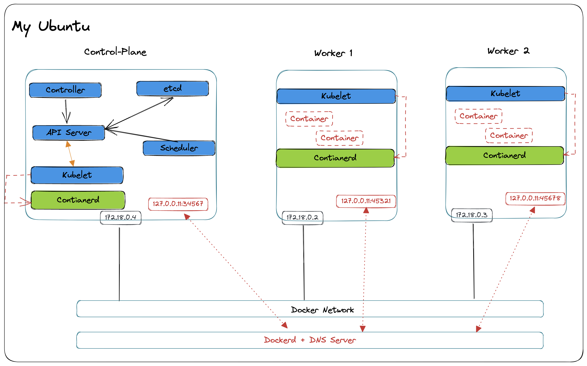
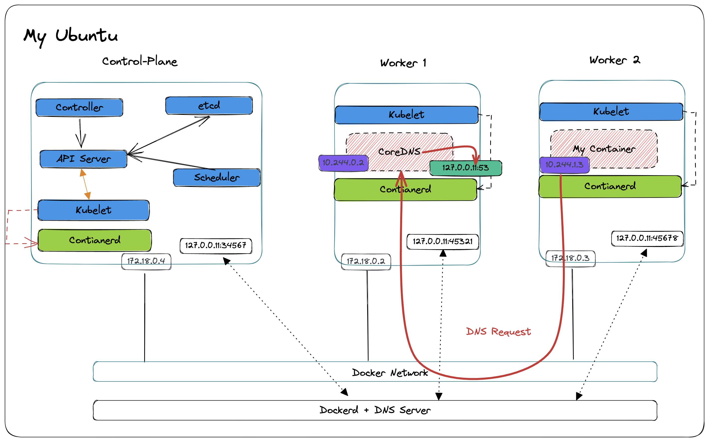
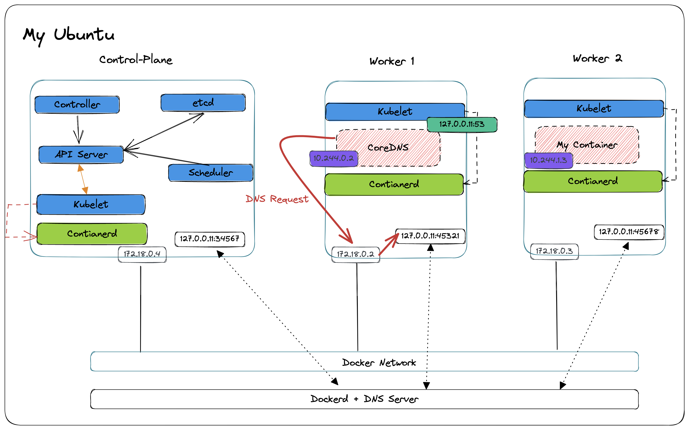

# 前言
Kubernertes in Docker(KIND) 是 Kubernetes-sig 社群內所維護的一個開源專案，該專案目的是透過 Docker 提供一個簡易的 Kubernetes 環境來提供 Kubernetes CI 測試。

Kubernetes 本身就是容器協作平台，因此透過 Docker 作為其節點，因此整體架構是基於 Container in Container 的概念，中間實作的過程也產生一些雙層容器產生的問題，而本篇文章主要探討是這過程中一個關於 DNS 的實作問題。

# 實驗環境
[KIND](https://github.com/kubernetes-sigs/kind?WT.mc_id=AZ-MVP-5003331) 的架構是基於 Docker 去完成，本文的實驗環境是於 Ubuntu 20.04 上以 KIND 創建一個三節點的 Kubernetes 叢集，其中一個節點作為控制平面，另外兩個則作為一般的 Worker.

以 Docker 來說，必須要起三個 Docker Container 來模擬 Kubernetes 節點，
這些 Container 彼此之間透過 Docker Network 來處理網路連接性的問題，整體架構類似如下圖

環境中會部署三個 Container，所有 Container 本身都會有屬於 Docker Network 網段的 IP，同時上面都會有該 Contianer Image 內所包含的 Application 與 Library.

而已 Kubernetes 來說，為了達成一個三節點的 Kubernetes，叢集內必須要有控制平面來提供如 etcd, scheduler, controller, api-server 等功能，而節點上則必須要安裝 kubelet 以及相關的 container runtime 來負責 container 的生命週期管理。
其概念如下圖


而 KIND 的環境就是將這兩者結合，因此實際上整體架構如下


透過 Docker 所起的 Container 內會安裝 Containerd 來負責 K8s Container 的生命週期，同時也透過 kubelet 等與控制平面連線以形成 k8s 叢集。

# Docker DNS

有玩過 Docker-Compose 的讀者應該都知道可以為了方便容器間的存取，可以直接使用容器名稱作為 DNS 的目標來存取，此設計使得容器不需要去煩惱 IP 變化的問題。
Docker 實際上會於自己的系統中內嵌一個 DNS Server 來處理這個議題，而這個 DNS 目前固定的 IP 則是 127.0.0.11。

該 DNS 的職責可以分兩類
1. 若 DNS 請求是 Container 名稱，則回覆 Container 的 IP
2. 否則就依照 Host 上的設定，讓上游 DNS 伺服器來處理該 DNS 請求。

下圖所示一個是運行兩個 Container 的範例，該範例中運行的 Container 分別為 hwchiu 以及 hwchiu2。


可以看到透過 `nslookup` 可以輕易地解出對應的 IP 地址，同時也可以觀察到這些容器的 `/etc/hosts` 都被動態的改成指向 `127.0.0.11`，這意味容器內所有 DNS 請求都會預設的被導向 127.0.0.11，這個 Docker 內建的 DNS Server。

然而 Docker DNS 實際上有一些問題值得探討
1. Docker DNS 伺服器到底運行在哪裡? Docker 是什麼時候運行起來的? 為什麼透過 `ps` 等指令都沒有辦法於 Container 中發現其蹤跡
2. 常見的 DNS 都會基於 port 53 溝通， Docker DNS 伺服器如果把 port 53 用走，是不是就導致 Container 沒有辦法運行第二個使用 port 53 的服務？ 這樣是不是就很難用 Docker container 來部署其他 DNS Server 的服務?

為了解決這兩個疑惑，必須要先來理解一下 Docker DNS 的實作方式，瞭解其實作方式就有辦法精準的回答上述問題。

## 實作
Docker DNS 的設計非常精巧，其利用 Linux namespace 的概念來完美處理這個問題，讓所有的 Docker DNS 伺服器運行於 Host 本身上(Pid namespace)，同時網路的部分則是聽到所有 container 裡面(network namespace)。

這種架構使得你有辦法透過 `127.0.0.11` 去存取 DNS Server 但是你又沒有辦法於 Container 內找到這個 DNS Server 的行程。

同時為了避免 DNS Server 會與使用者自己的 DNS 服務衝突，所以 Docker DNS 就不會使用 Port 53，而採取一個隨機的數字。

整體架構如下圖


但是對於 Container 服務來說，由於 `/etc/hosts` 已經被改為使用 `127.0.0.11` 當作預設的 DNS 搜尋，而且預設都會基於 Port 53 來使用，所以 Dockerd 這邊又仰賴 iptables 的幫助來動態調整規則，把所有送往 `127.0.0.11:53` 的封包都動態修改其目標 port 來處理連結問題。

因此你若透過 nsenter 等指令進入到容器內觀察，使用 `ss` 與 `iptalbse` 的指令可以觀察到如下圖的結果


其中 `ss` 顯示了環境中 `127.0.0.11` 有監聽兩個 Port，分別對應 TCP 與 UDP 的 DNS 請求，而 `iptables` 則顯示的相關 DNAT 的規則

透過這些處理就能夠讓 container 所有的 DNS 請求都由 Docker DNS 進行處理，同時又不會預先霸佔 Port 53。

這邊可以看到相關[原始碼](https://github.com/moby/libnetwork/blob/67e0588f1ddfaf2faf4c8cae8b7ea2876434d91c/resolver_unix.go?WT.mc_id=AZ-MVP-5003331)，該程式碼顯示了 Docker 會動態修改四條規則來處理 DNAT + SNAT 的需求。

```golang=
...
	resolverIP, ipPort, _ := net.SplitHostPort(os.Args[2])
	_, tcpPort, _ := net.SplitHostPort(os.Args[3])
	rules := [][]string{
		{"-t", "nat", "-I", outputChain, "-d", resolverIP, "-p", "udp", "--dport", dnsPort, "-j", "DNAT", "--to-destination", os.Args[2]},
		{"-t", "nat", "-I", postroutingchain, "-s", resolverIP, "-p", "udp", "--sport", ipPort, "-j", "SNAT", "--to-source", ":" + dnsPort},
		{"-t", "nat", "-I", outputChain, "-d", resolverIP, "-p", "tcp", "--dport", dnsPort, "-j", "DNAT", "--to-destination", os.Args[3]},
		{"-t", "nat", "-I", postroutingchain, "-s", resolverIP, "-p", "tcp", "--sport", tcpPort, "-j", "SNAT", "--to-source", ":" + dnsPort},
	}
...
```

到這邊為止已經對 Docker DNS 有基本的瞭解，接下來看一下 Kubernetes 的情況

# Kubernetes

Kubernetes 叢集中也有一個 DNS Server，從早期的 Kube-DNS 到現在的 CoreDNS，其功用與 Docker DNS 非常類似
1. 若 DNS 請求是 Kubernetes 內部服務，則回應內部資訊
2. 否則將該請求給轉發給上游 DNS 伺服器處理

與 Docker DNS 一樣，都是專注處理自己服務的請求，不行就往外轉發。

然而對於 CoreDNS 來說，所謂的上游 DNS 伺服器預設情況下就是節點所使用的 DNS 伺服器，也就是所謂的 `127.0.0.11`。

因此整個流程如下


假設 `worker2` 上的 Pod 想要詢問一個 DNS 請求，該請求輾轉送到了 CoreDNS 去處理，而 CoreDNS 無法解析的情況下，想要轉發給上游 DNS Server，因此就轉送給了 `127.0.0.11`，而這邊就是問題的發生所在。

## Issue

由於 `127.0.0.11` 是 Dockerd 特製的，因此由 Docker Continaer 上的 Containerd 所管理 CoreDNS 自然而然就沒有這個功能，既沒有相關 iptables 也沒有相關的 Docker DNS 伺服器

因此對於 `CoreDNS` 來說，所有送往 `127.0.0.11` 的 DNS 封包就如同送往黑洞般，沒人處理。

為了解決這個問題， KIND 的想法就是讓 CoreDNS 不要把封包送給 `127.0.0.11`，而是送往節點的 IP，並且透轉發最終送到節點上的 `127.0.0.11` 服務

整個流程如下


前述提到 CoreDNS 本身會使用節點上的 `/etc/hosts` 當作上游伺服器，因此這邊的做法就是動態修正節點上的 `/etc/hosts`，將預設 DNS 伺服器從 `127.0.0.11` 改成節點本身的 IP，以範例圖來說就是 `172.18.0.2`。

一旦修改了預設請求位置，所有 `Dockerd` 所設立的 iptables 規則就沒有辦法使用，因此時候又要重新修改 `iptables` 來滿足。

以下是一開始 Dockerd 所設定的 iptables 規則


而 KIND 則會將其修改成如下(來自不同節點的範例，該節點 IP 是 **172.18.0.1**)


可以看到這時候所有送往 `172.18.0.1` 的封包都會被轉向 `127.0.0.11:33501/41285`，也就是 Docker DNS 的位置，同時也針對 SNAT 的地方進行修改。


從 KIND 的[原始碼](https://github.com/kubernetes-sigs/kind/blob/main/images/base/files/usr/local/bin/entrypoint#L459-L470?WT.mc_id=AZ-MVP-5003331) 這邊可以看到

``` bash=
  # well-known docker embedded DNS is at 127.0.0.11:53
  local docker_embedded_dns_ip='127.0.0.11'

  # first we need to detect an IP to use for reaching the docker host
  local docker_host_ip
  docker_host_ip="$( (head -n1 <(timeout 5 getent ahostsv4 'host.docker.internal') | cut -d' ' -f1) || true)"
  # if the ip doesn't exist or is a loopback address use the default gateway
  if [[ -z "${docker_host_ip}" ]] || [[ $docker_host_ip =~ ^127\.[0-9]+\.[0-9]+\.[0-9]+$ ]]; then
    docker_host_ip=$(ip -4 route show default | cut -d' ' -f3)
  fi

  # patch docker's iptables rules to switch out the DNS IP
  iptables-save \
    | sed \
      `# switch docker DNS DNAT rules to our chosen IP` \
      -e "s/-d ${docker_embedded_dns_ip}/-d ${docker_host_ip}/g" \
      `# we need to also apply these rules to non-local traffic (from pods)` \
      -e 's/-A OUTPUT \(.*\) -j DOCKER_OUTPUT/\0\n-A PREROUTING \1 -j DOCKER_OUTPUT/' \
      `# switch docker DNS SNAT rules rules to our chosen IP` \
      -e "s/--to-source :53/--to-source ${docker_host_ip}:53/g"\
      `# nftables incompatibility between 1.8.8 and 1.8.7 omit the --dport flag on DNAT rules` \
      `# ensure --dport on DNS rules, due to https://github.com/kubernetes-sigs/kind/issues/3054` \
      -e "s/p -j DNAT --to-destination ${docker_embedded_dns_ip}/p --dport 53 -j DNAT --to-destination ${docker_embedded_dns_ip}/g" \
    | iptables-restore

  # now we can ensure that DNS is configured to use our IP
  cp /etc/resolv.conf /etc/resolv.conf.original
  replaced="$(sed -e "s/${docker_embedded_dns_ip}/${docker_host_ip}/g" /etc/resolv.conf.original)"
  if [[ "${KIND_DNS_SEARCH+x}" == "" ]]; then
    # No DNS search set, just pass through as is
    echo "$replaced" >/etc/resolv.conf
  elif [[ -z "$KIND_DNS_SEARCH" ]]; then
    # Empty search - remove all current search clauses
    echo "$replaced" | grep -v "^search" >/etc/resolv.conf
  else
    # Search set - remove all current search clauses, and add the configured search
    {
      echo "search $KIND_DNS_SEARCH";
      echo "$replaced" | grep -v "^search";
    } >/etc/resolv.conf
  fi
```

KIND 所搭建的 K8s 節點每次運行起來時都會去修改 iptalbes 的規則，同時也更新 `/etc/resolve.conf` 的預設地址

透過這些修改， CoreDNS 就會將 DNS 請求給送往節點本，而這些 DNS 請求又會透過 iptables 轉發給 Docker DNS 進行處理，當 Docker DNS 不能處理時又會再度往上轉發到最初 Host 上的設定，一層又一層的轉出去。

# Summary
1. Docker 有內建的 DNS 伺服器用來處理 Docker Container 間的 DNS 請求
2. Docker 透過 iptables 與 namespace 來簡化整個 DNS 的部署與運作
3. Kubernetes 內的 CoreDNS 預設情況下會受到 Docker DNS 的影響，因為 /etc/resolve 被修改
4. KIND 則是二次修改這些規則，改動 /etc/resolve 與 iptables 規則來修正所有路線，確保 DNS 都可以往外轉發。

