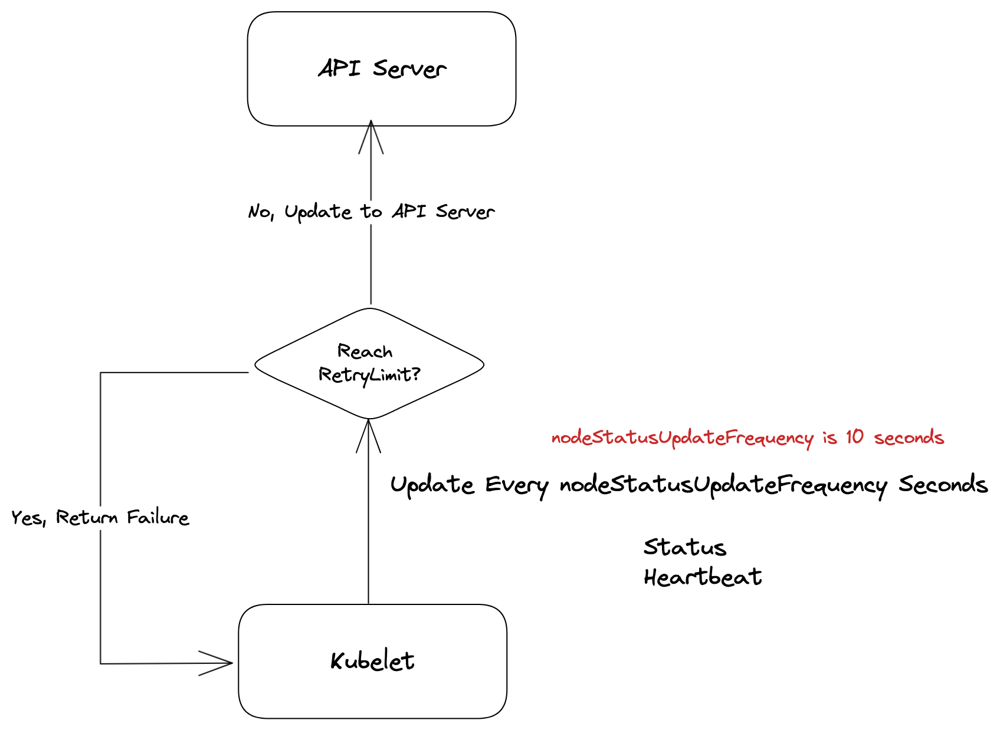
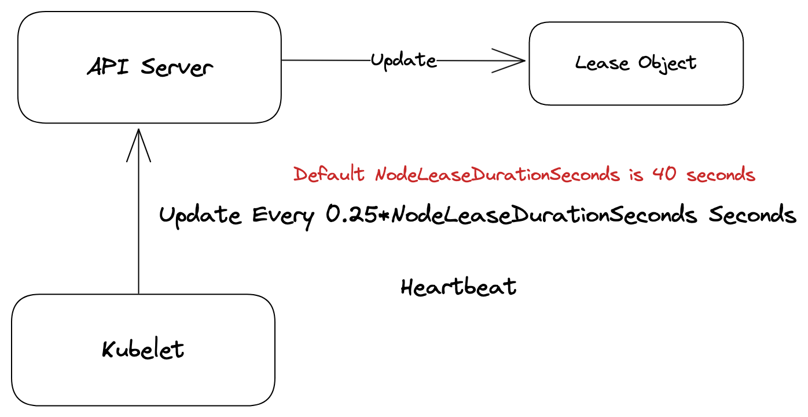
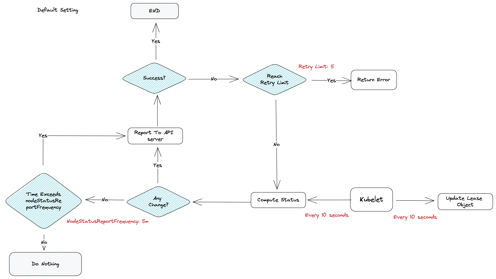
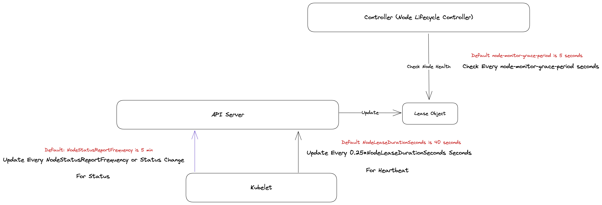
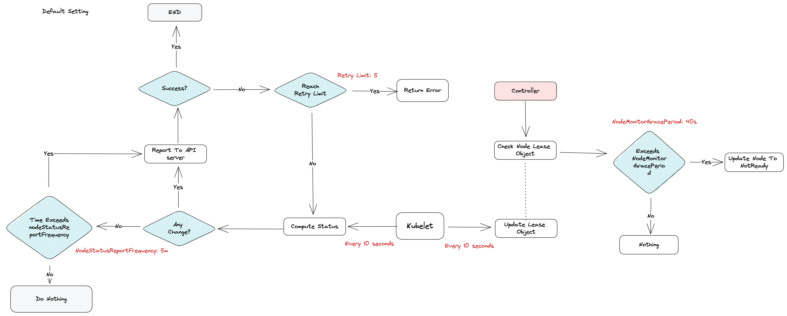

# 前言

Kubernetes 除了基本的 Pod 類型外也提供諸多更高階的運算類型，如 Deployment, DaemonSet, StatefulSet 等，而這些高階管理器能夠讓你的 Pod 以多副本的方式來提供服務，基於多副本的架構下更容易去達到高可用性的架構。

然而當 Kubernetes 節點出現故障問題，譬如斷掉，網路損毀，系統損毀等狀況導致該節點暫時不能使用時，節點上的 Pod 該何去何從？

從高可用性的角度來說，有些人會認為應用程式有多個副本，所以節點壞掉不影響服務運作，但是某些情況下，該應用程式屬於 StatefulSet，因此沒有辦法不停水平擴展，這種情況下就會需要當節點壞損時，相關 Pod 被快速重新調度來提供服務。

# 實驗環境
[KIND](https://github.com/kubernetes-sigs/kind?WT.mc_id=AZ-MVP-5003331) 的架構是基於 Docker 去完成，本文的實驗環境是於 Ubuntu 20.04 上以 KIND 創建一個三節點的 Kubernetes 叢集，其中一個節點作為控制平面，另外兩個則作為一般的 Worker.

# 節點

Kubelet 本身屬於節點上的 Agent，其本身會定期計算與回報關於節點的狀態並且通知控制平面，技術上目前有兩種不同的實作方式，其中的分水嶺可以認定為 1.17 以後。

首先我們要先知道，到底 Kubelet 需要回報什麼資訊給控制平面，以下列指令 `kubectl get nodes k8slab-worker2 -o yaml` 為範例

```yaml=
status:
  addresses:
  - address: 172.18.0.2
    type: InternalIP
  - address: k8slab-worker2
    type: Hostname
  allocatable:
    cpu: "4"
    ephemeral-storage: 30298176Ki
    hugepages-1Gi: "0"
    hugepages-2Mi: "0"
    memory: 16386892Ki
    pods: "110"
  capacity:
    cpu: "4"
    ephemeral-storage: 30298176Ki
    hugepages-1Gi: "0"
    hugepages-2Mi: "0"
    memory: 16386892Ki
    pods: "110"
  conditions:
  - lastHeartbeatTime: "2023-08-27T03:48:19Z"
    lastTransitionTime: "2023-08-23T17:07:50Z"
    message: kubelet has sufficient memory available
    reason: KubeletHasSufficientMemory
    status: "False"
    type: MemoryPressure
  - lastHeartbeatTime: "2023-08-27T03:48:19Z"
...
```

基本上整個 status 欄位內的所有資訊都需要由 kubelet 回報，而這些欄位可以觀察到資訊繁多，傳遞的資訊量並不小。

因此從 kubelet 回傳資訊的角度來看，實際上可以區分成兩種回報
1. Status 的內容回報
2. Heartbeat 的健康度更新

而本文所探討的重點，當節點被標示為 "NotReady" 狀況的反應實際上對應到的就是 (2) 的資訊，所謂的 heartbeat 資訊

從[官方文件](https://kubernetes.io/docs/reference/node/node-status/#heartbeats) 中所述，節點的 Heartbeats 可以區分成兩種方式，分別是
1. updates to the .status of a Node
2. Lease objects within the kube-node-lease namespace. Each Node has an associated Lease object.

接下來就針對這兩種實作方式探討一下概念與相關設定檔案。

## NodeStatus

如同前述， Kubelet 本身會需要回傳節點上的各種運作狀態以及 heartbeat 資訊，而最初的 Kubernetes 則是將這兩個資訊一起更新，其更新的頻率預設是 10 秒，可以透過 [KubeletConfiguration](https://kubernetes.io/docs/reference/config-api/kubelet-config.v1beta1/#kubelet-config-k8s-io-v1beta1-KubeletConfiguration)
內的 `nodeStatusUpdateFrequency` 的欄位更新

此外對於每次的狀態更新， kubelet 都有實作重試機制，每次傳遞預設都會嘗試五次，而這個數字目前是不可更改的，寫死於[程式碼, kubelet.go](https://github.com/kubernetes/kubernetes/blob/v1.28.0/pkg/kubelet/kubelet.go#L133?WT.mc_id=AZ-MVP-5003331)中

```golang=
const (
	// nodeStatusUpdateRetry specifies how many times kubelet retries when posting node status failed.
	nodeStatusUpdateRetry = 5
    ....
)
```

```golang=
func (kl *Kubelet) updateNodeStatus(ctx context.Context) error {
	klog.V(5).InfoS("Updating node status")
	for i := 0; i < nodeStatusUpdateRetry; i++ {
		if err := kl.tryUpdateNodeStatus(ctx, i); err != nil {
			if i > 0 && kl.onRepeatedHeartbeatFailure != nil {
				kl.onRepeatedHeartbeatFailure()
			}
			klog.ErrorS(err, "Error updating node status, will retry")
		} else {
			return nil
		}
	}
	return fmt.Errorf("update node status exceeds retry count")
}
```

下圖簡易的描述更新方式



然而這種實作方式實務上卻帶來的效能上的瓶頸，每次 kubelet 資訊回報都伴隨大量的狀態資訊，每十秒一次且節點數量過多時，就會對整個 etcd 造成系統壓力使得整個叢集的效能降低，因此 1.13 版本後決定採用新的實作方式並且於 1.17 版本正式宣佈為 stable 版本。

## Lease

為了改善整個 NodeStatus 更新的效率與效能問題，[Official Proposal](https://github.com/kubernetes/enhancements/tree/master/keps/sig-node/589-efficient-node-heartbeats?WT.mc_id=AZ-MVP-5003331)被提出並且打算採用基於 Lease 架構來完成，其核心概念就是將前述的 NodeStatus 與 Heartbeat 兩個資訊給拆開，兩件事情獨立去處理。

Heartbeat 本身的流量負擔小，維持過往的頻率並不會造成多大的效能問題，然而 NodeStatus 的資訊相對龐大，因此其更新頻率就進行調整。

### Heartbeat
以 Heartbeat 來說，採用 Kubernetes 內建API Lease 的架構，當此架構運作時，可以觀察到系統會自動創建一個名為 `kube-node-lease` 的 namespace，並且所有個 K8s 節點都會與之對應到一個同名稱的 Lease 物件

```bash=
azureuser@course:~$ kubectl -n kube-node-lease get lease
NAME                   HOLDER                 AGE
k8slab-control-plane   k8slab-control-plane   3d13h
k8slab-worker          k8slab-worker          3d13h
k8slab-worker2         k8slab-worker2         3d13h
```

```bash=
azureuser@course:~$ kubectl -n kube-node-lease get lease k8slab-worker -o yaml
apiVersion: coordination.k8s.io/v1
kind: Lease
metadata:
  creationTimestamp: "2023-08-23T17:08:00Z"
  name: k8slab-worker
  namespace: kube-node-lease
  ownerReferences:
  - apiVersion: v1
    kind: Node
    name: k8slab-worker
    uid: 70c3c25d-dc3d-4ad3-ba3a-36637d3b5b60
  resourceVersion: "623846"
  uid: 08013bd8-2dd9-45fe-ad6d-38b77253b437
spec:
  holderIdentity: k8slab-worker
  leaseDurationSeconds: 60
  renewTime: "2023-08-27T03:21:06.584188Z"
```

這些 Lease 物件則透過 renewTime 與 holderIdentity 來代表每個節點最後一次更新的時候，這些時間之後會被 Controller 用來判定節點本身是否 Ready/NotReady.


根據 [kubelet 原始碼](https://github.com/kubernetes/kubernetes/blob/master/pkg/kubelet/kubelet.go#L862-L873?WT.mc_id=AZ-MVP-5003331)

```golang=
const (
	// nodeLeaseRenewIntervalFraction is the fraction of lease duration to renew the lease
	nodeLeaseRenewIntervalFraction = 0.25
)
...


leaseDuration := time.Duration(kubeCfg.NodeLeaseDurationSeconds) * time.Second
renewInterval := time.Duration(float64(leaseDuration) * nodeLeaseRenewIntervalFraction)
klet.nodeLeaseController = lease.NewController(
    klet.clock,
    klet.heartbeatClient,
    string(klet.nodeName),
    kubeCfg.NodeLeaseDurationSeconds,
    klet.onRepeatedHeartbeatFailure,
    renewInterval,
    string(klet.nodeName),
    v1.NamespaceNodeLease,
    util.SetNodeOwnerFunc(klet.heartbeatClient, string(klet.nodeName)))

```

可以觀察到 renewInternval 的計算方式是 `nodeLeaseRenewIntervalFraction` * `NodeLeaseDurationSeconds`，前者是一個固定的常數 0.25，而後者根據 [kubelet](https://kubernetes.io/docs/reference/config-api/kubelet-config.v1beta1/#kubelet-config-k8s-io-v1beta1-KubeletConfiguration) 中關於 nodeLeaseDurationSeconds 的介紹，預設值是 `40`。

根據這個計算可以得到 0.25 * 40 = 10，因此 kubelet 每 10 秒會更新一次。

根據這個理論，嘗試透過指令觀察 Lease 物件的變化
`kubectl -n kube-node-lease get lease k8slab-worker2 -o yaml -w`


```yaml=
---
apiVersion: coordination.k8s.io/v1
kind: Lease
metadata:
  creationTimestamp: "2023-08-23T17:08:00Z"
  name: k8slab-worker2
  namespace: kube-node-lease
  ownerReferences:
  - apiVersion: v1
    kind: Node
    name: k8slab-worker2
    uid: 5ad224c5-11ad-4939-8cfa-0066eb86d6b9
  resourceVersion: "655385"
  uid: bf558925-25b8-4483-9f9d-4a78521afa4c
spec:
  holderIdentity: k8slab-worker2
  leaseDurationSeconds: 40
  renewTime: "2023-08-27T07:39:35.899240Z"
---
apiVersion: coordination.k8s.io/v1
kind: Lease
metadata:
  creationTimestamp: "2023-08-23T17:08:00Z"
  name: k8slab-worker2
  namespace: kube-node-lease
  ownerReferences:
  - apiVersion: v1
    kind: Node
    name: k8slab-worker2
    uid: 5ad224c5-11ad-4939-8cfa-0066eb86d6b9
  resourceVersion: "655405"
  uid: bf558925-25b8-4483-9f9d-4a78521afa4c
spec:
  holderIdentity: k8slab-worker2
  leaseDurationSeconds: 40
  renewTime: "2023-08-27T07:39:45.982209Z"
```
從上述物件的更新狀態，觀察 renewTime 的差異，分別是 **07:39:45** 與 **07:39:35**，其差值為 10 秒，與理論一致。


嘗試將該 leaseDurationSeconds 改成 60 秒，觀察 `renewTime` 的變化。
```yaml=
apiVersion: coordination.k8s.io/v1
kind: Lease
metadata:
  creationTimestamp: "2023-08-23T17:08:00Z"
  name: k8slab-worker
  namespace: kube-node-lease
  ownerReferences:
  - apiVersion: v1
    kind: Node
    name: k8slab-worker
    uid: 70c3c25d-dc3d-4ad3-ba3a-36637d3b5b60
  resourceVersion: "654971"
  uid: 08013bd8-2dd9-45fe-ad6d-38b77253b437
spec:
  holderIdentity: k8slab-worker
  leaseDurationSeconds: 60
  renewTime: "2023-08-27T07:36:14.454825Z"
---
apiVersion: coordination.k8s.io/v1
kind: Lease
metadata:
  creationTimestamp: "2023-08-23T17:08:00Z"
  name: k8slab-worker
  namespace: kube-node-lease
  ownerReferences:
  - apiVersion: v1
    kind: Node
    name: k8slab-worker
    uid: 70c3c25d-dc3d-4ad3-ba3a-36637d3b5b60
  resourceVersion: "655003"
  uid: 08013bd8-2dd9-45fe-ad6d-38b77253b437
spec:
  holderIdentity: k8slab-worker
  leaseDurationSeconds: 60
  renewTime: "2023-08-27T07:36:29.654757Z"
```

可以觀察到兩個時間分別為 **07:36:29** 與 **07:36:14**，間隔為 15 秒，與計算理論相符。

Lease 架構下透過此方式來更新節點的最新 heartbeat 狀態，至於 Controller 是如何利用這些資訊判斷節點是否為 Ready/NotReady 等等就會介紹。

以下列圖來總結一下 Lease 架構下 Heartbeat 的更新方式



### Status

為了改善 Status 傳送資料頻繁造成 etcd 壓力的問題，新架構中將 Status 的傳送機制進行調整，首先將 Status 分成兩個階段
1. 計算
2. 回報

**計算**階段就是去統計收集當前節點上的資訊，而**回報**則是將這些資訊給回報給 API Server，而這兩個階段是獨立進行，因此彼此的運作週期是不一致的。

以**計算**來說，目前預設情況下是每 **10s** 去計算一次，而**回報**部分則有兩個步驟
1. 根據**計算**結果，若有任何有意義的更新則馬上回報給 API Server
2. 否則，等待 **5m** 的時間才更新到 API Server。

根據 [KubeletConfiguration](https://kubernetes.io/docs/reference/config-api/kubelet-config.v1beta1/#kubelet-config-k8s-io-v1beta1-KubeletConfiguration) 中的介紹，可以透過 **nodeStatusUpdateFrequency** 與 **nodeStatusReportFrequency** 兩個變數來分別調整相關頻率。

根據說明
```
nodeStatusUpdateFrequency is the frequency that kubelet computes node status. 
If node lease feature is not enabled, it is also the frequency that kubelet posts node status to master. 
Note: When node lease feature is not enabled, be cautious when changing the constant,
it must work with nodeMonitorGracePeriod in nodecontroller. Default: "10s"

nodeStatusReportFrequency is the frequency that kubelet posts 
node status to master if node status does not change. Kubelet will ignore this frequency and post node status immediately if any 
change is detected. It is only used when node lease feature is enabled. nodeStatusReportFrequency's default value is 5m. 
But if nodeStatusUpdateFrequency is set explicitly, nodeStatusReportFrequency's default value will be set 
to nodeStatusUpdateFrequency for backward compatibility. Default: "5m"
```

根據 [kubelet 相關程式碼](https://github.com/kubernetes/kubernetes/blob/v1.28.0/pkg/kubelet/kubelet_node_status.go#L570)

```golang=
originalNode, err := kl.heartbeatClient.CoreV1().Nodes().Get(ctx, string(kl.nodeName), opts)
if err != nil {
    return fmt.Errorf("error getting node %q: %v", kl.nodeName, err)
}
if originalNode == nil {
    return fmt.Errorf("nil %q node object", kl.nodeName)
}

node, changed := kl.updateNode(ctx, originalNode)
shouldPatchNodeStatus := changed || kl.clock.Since(kl.lastStatusReportTime) >= kl.nodeStatusReportFrequency
```

每次進行 NodeStatus 更新時都會嘗試跟當前物件進行比對，只有當有物件發生改變或是時間超過 **nodeStatusReportFrequency** 時才會真正的發送資訊到 API Server。

藉由這種機制降低整個更新頻率，並降低頻繁更新造成的效能影響。

將兩者結合起來的話，其示意圖如下


以預設設定下，運作邏輯圖如下， Kubelet 如今產生兩條不同的路，一條負責 Status，一條負責 Heartbeat




## Controller Manager

前述探討了 Kubelet 是如何回報節點到控制平面，而真正判別節點為 Reday/NotReady 則是由 Controller 內的 node lifecycle controller 來判別的。

其概念很簡單，就是定期去檢查每個節點對應的 Lease 物件狀態，只要該 Lease 物件超過一定時間沒有 Renew，就認定該節點太久沒有回報資訊，因此會將其狀態設定為 NotReady。

上述概念內有兩個參數可以設定
1. Controller 多久去檢查 Lease 物件
2. Renew 時間超過多久沒有更新視為 NotReady

根據 [kube-controller-manager](https://kubernetes.io/docs/reference/command-line-tools-reference/kube-controller-manager/) 中所述，有兩個參數可以調整，分別是
**--node-monitor-period duration** 與 **--node-monitor-grace-period duration**

**node-monitor-period** 的說明如下 (預設 5s)
```
The period for syncing NodeStatus in cloud-node-lifecycle-controller.
```

而由 [Controller 原始碼](https://github.com/kubernetes/kubernetes/blob/v1.28.0/pkg/controller/nodelifecycle/node_lifecycle_controller.go#L502-L507?WT.mc_id=AZ-MVP-5003331)

可以觀察到下列的設定
```golang=
...
// Incorporate the results of node health signal pushed from kubelet to master.
go wait.UntilWithContext(ctx, func(ctx context.Context) {
    if err := nc.monitorNodeHealth(ctx); err != nil {
        logger.Error(err, "Error monitoring node health")
    }
}, nc.nodeMonitorPeriod)
...
```

期透過 go routine 每 nodeMonitorPeriod 的時間就去執行一次 **monitorNodeHealth** 來檢查節點的狀況。

而 **node-monitor-grace-period** 的說明如下(預設 40s)
```
Amount of time which we allow running Node to be unresponsive before marking it unhealthy. Must be N times more than kubelet's nodeStatusUpdateFrequency, where N means number of retries allowed for kubelet to post node status.
```


根據 [Controller 原始碼](https://github.com/kubernetes/kubernetes/blob/v1.28.0/pkg/controller/nodelifecycle/node_lifecycle_controller.go#L821?WT.mc_id=AZ-MVP-5003331)

```golang=
func (nc *Controller) tryUpdateNodeHealth(ctx context.Context, node *v1.Node) (time.Duration, v1.NodeCondition, *v1.NodeCondition, error) {
...
	if currentReadyCondition == nil {
...
	} else {
		// If ready condition is not nil, make a copy of it, since we may modify it in place later.
		observedReadyCondition = *currentReadyCondition
		gracePeriod = nc.nodeMonitorGracePeriod
	}
...
	if nc.now().After(nodeHealth.probeTimestamp.Add(gracePeriod)) {
		// NodeReady condition or lease was last set longer ago than gracePeriod, so
		// update it to Unknown (regardless of its current value) in the master.
....
	}
....
}
```

由上述的程式碼可以觀察到，其會先將設定好的 nodeMonitorGracePeriod 賦予到本地變數 gracePeriod，接者就會去檢查當前時間是否超過 lease + gracePeriod， 若是則將節點設定為 NotReady，並且理由設定為 "Unknown"。

範例如下 (kubectl get node k8slab-worker -o yaml)
```yaml=
status:
  conditions:
  - lastHeartbeatTime: "2023-08-27T14:03:45Z"
    lastTransitionTime: "2023-08-27T14:04:30Z"
    message: Kubelet stopped posting node status.
    reason: NodeStatusUnknown
    status: Unknown
    type: Ready

```


所以將這些概念整合起來，可以得到下列的概念圖，Kubelet 本身與 Controller 是非同步工作，一個負責更新狀態，一個負責確認狀態並且更新



而整個邏輯工作流程則可以用下圖來表達



# Evict Pod

前述探討的是 Kubernetes 如何將一個節點視為故障(NotReady)，那當節點為 NotReady 後，節點上運行的 Pod 會多久才被重生?

這部分 Kubernetes 是利用了 Taint/Toleration 的機制來達到自動重生的，詳細說明可以參閱 [Kubernetes Taint Based Evicition](https://kubernetes.io/docs/concepts/scheduling-eviction/taint-and-toleration/#taint-based-evictions)。

簡單來說，當節點被判定為故障時，會自動被打上一個 **node.kubernetes.io/not-ready** 的 Taint，而每個 Pod 可以透過 Toleration 搭配 tolerationSeconds 來決定能夠忍受該節點多久，時間一到無法忍受則自動會被重新部署。

根據 [API-Server](https://kubernetes.io/docs/reference/command-line-tools-reference/kube-apiserver/) 文件可以發現兩個相關設定

```
--default-not-ready-toleration-seconds int     Default: 300
Indicates the tolerationSeconds of the toleration for notReady:NoExecute 
that is added by default to every pod that does 
not already have such a toleration.

--default-unreachable-toleration-seconds int     Default: 300
Indicates the tolerationSeconds of the toleration for unreachable:NoExecute 
that is added by default to every pod that does 
not already have such a toleration.
```

這兩個設定預設都是 300 秒，這意味者當節點被標示為損壞後，運行的 Pod 會存活至少 300s 才會被移除重新部署。

而該數值除了透過 API-Server 設定預設值外，每個 Pod 也可以獨立設定，範例如下
```yaml=
tolerations:
- key: "node.kubernetes.io/unreachable"
  operator: "Exists"
  effect: "NoExecute"
  tolerationSeconds: 20
```

因此如果希望 Pod 可以更快的因應節點故障而被重新部署，則部署的時候可以調整 `tolerationSeconds` 讓其更快被反應，另外也可以從 kubelet/controller 的參數去調整讓節點更快的被識別為損壞來觸發節點的重新調度行為。


# Summary

1. Kubelet 於 1.17 後都採用 Lease 的方式來回報 heartbeat
2. Kubelet 與 Controller 是非同步工作，一個負責回報，一個負責監控，彼此間的 timeout 設定上要仔細與小心
3. kubelet 上的 **nodeLeaseDurationSeconds** 決定多久更新一次 Lease 物件，目前設定的數值*0.25 則是最後的秒數
4. Contoller 上的 **node-monitor-period** 與 **node-monitor-grace-period** 則決定 Controller 多久檢查一次，以及超時多久要判定為 NotReady.
5. 預設情況下，最快需要 40 秒去偵測節點故障
6. 預設情況下，每個 Pod 可以於故障節點上存活 300 秒
7. 預設情況下，一個 Pod 最快需要 340 秒才可以從故障節點中被重新部署
8. Pod 可以透過 Taint-Based Evicition 的方式來調整反應時間

# Reference
- https://github.com/kubernetes-sigs/kubespray/blob/master/docs/kubernetes-reliability.md
- https://kubernetes.io/docs/concepts/scheduling-eviction/taint-and-toleration/#taint-based-evictions
- https://github.com/kubernetes/enhancements/tree/master/keps/sig-node/589-efficient-node-heartbeats

