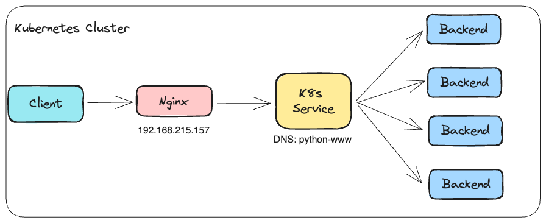

本篇文章記錄使用 Nginx 作為 Reverse Proxy 遇到的 DNS 問題，該問題主要是 Nginx 使用 DNS 來連接後方的服務器，但是當 DNS 內容更新時
Nginx 並沒有重新反查該 DNS 取得最新的結果，該結果最後導致所有 Client 的連線都會被送往舊的 DNS 紀錄，最後產生 Timeout。
文章將就這個流程嘗試檢視其原因並且探討目前的解法

# 環境建置

為了簡化整個 DNS 的操作與設定，因此使用 Kubernetes 來搭建測試環境，整個環境如下圖


註: 這邊的 Nginx 就是單純的 Nginx 服務，本身並沒有牽扯到任何 Ingress Controller 的部分

該環境總共會部署三種服務，分別是
1. Backend: 一個基於 python 的網頁伺服器，代表後端的服務，本身會部署多個副本
2. Client: 嘗試透過 Nginx 存取到後方 Backend 的客戶
3. Nginx: 會透過 Proxy 的方式將從 Client 收到的請求都轉發到後方 Backend

如上方所述，為了簡化 DNS 的設定，這邊採用 Kubernetes Service 的方式來產生一個 DNS 紀錄並且對應到這四個 Pod

註: 本次的問題必須要使用 Headless 才會觸發，若使用 ClusterIP 則沒有任何問題，主要是 ClusterIP 的模式下，該 ClusterIP 並不會因為 Pod 重啟而有任何變化，因此對於 Nginx 角度來看則沒有任何變化

上述概念搭配實際 IP/DNS 後實際狀況如下


Backend 的相關資源


Nginx 的設定


Client 嘗試存取 Nginx 的結果


# 問題模擬

如開頭所述，問題是發生於 DNS 內容有任何更動時，目前查詢 `python-www` 的結果是反映當前四個 backend pod 的 IP，內容如下
```bash=
$ nslookup python-www
Server:         10.96.0.10
Address:        10.96.0.10#53

Name:   python-www.default.svc.cluster.local
Address: 192.168.215.159
Name:   python-www.default.svc.cluster.local
Address: 192.168.215.162
Name:   python-www.default.svc.cluster.local
Address: 192.168.215.158
Name:   python-www.default.svc.cluster.local
Address: 192.168.215.160
```

這時候嘗試將四個 Pod 都重啟，並且觀察 DNS 的回應是否有改變

```bash=
ubuntu@hwchiu:~$ kubectl rollout restart deploy python-www
deployment.apps/python-www restarted

---

$ nslookup python-www
Server:         10.96.0.10
Address:        10.96.0.10#53

Name:   python-www.default.svc.cluster.local
Address: 192.168.215.164
Name:   python-www.default.svc.cluster.local
Address: 192.168.215.166
Name:   python-www.default.svc.cluster.local
Address: 192.168.215.165
Name:   python-www.default.svc.cluster.local
Address: 192.168.215.163
```

當 DNS 改變後，這時候 Client 再度嘗試透過 nginx 存取看看後端服務


可以看到這時後 curl 就會沒有任何反應直到 timeout。

# 問題研究

該問題從 Kubernetes 的角度來看，已經有正確的更新 DNS 內容，若不透過 Nginx 都是可以正常存取後方這些服務的，因此問題主要是 Nginx 快取了這些 DNS 的結果，並且當 DNS 有變動時，並沒有嘗試重新解析。

以 Nginx 來說，以我使用的版本 1.10.3 為例，且使用的是下列設定
```
        location / {
                proxy_pass http://python-www:8000;
        }
```

這邊透過 tcpdump 去觀測當 nginx server 被叫起來瞬間時的網路流量，透過 port 53 去過濾 DNS 封包，結果如下


可以觀察到當 Nginx 伺服器起來時，可以馬上觀察到 DNS 的請求去嘗試解析 `python-www` ，因為該環境是處於 Kubernetes Pod 上，所以會有額外的 search 來加入後面的 "default.svc.cluster.local."。

保持 tcpdump 不關的情況下，這時候讓 Client 嘗試去發送封包，或是重啟四個 Pod 來改變四個 DNS 的結果，會發現再也沒有看到任何新的 DNS 封包。

從這邊的封包行為可以推論出該目前設定下的 Nginx 其運作行為是，當 Nginx Server 被叫起來的瞬間，就會去解析設定檔案並且針對 DNS 的部分去解析，後續則不會重新解析，因此若日後 DNS 有任何更動的話， Nginx 都會存取到舊的內容造成連線 timeout

# 問題解法

## 解法一
如果 Nginx 是啟動瞬間去解析的，那就可以透過 reload(nginx -s reload) 的方式讓 Nginx 重新解析，測試結果如下


這時候 client 又可以順利解析了，但是這種方式實務上不太方便，畢竟對 nginx 來說很難感知到什麼時候是需要 reload的，因此實務上並不是一個很方便的解法。

## 解法二
此問題網路上已經有眾多討論，可以看到一個比較通俗的解法就是透過變數的方式帶入到 proxy_pass 內，透過一些不同的設定方式可以迫使 Nginx 每次建立新連線前都會透過 DNS 去解析一次，透過這種方式就不必擔心 DNS 變動帶來的 timeout 問題。

使用的方式需要搭配 resolver 以及 set 等方式
```

        location / {
                resolver 10.96.0.10;
                set $target http://python-www;
                proxy_pass $target:8000;
        }          
```

當 nginx 以此方式配置後，透過 tcpdump 可觀察到每次有新的連線時都會有連線，但是這時候 client 卻看到滿滿的 timeout


從上述截圖可以看到 DNS 的 request 內容並沒有之前 search 添加的那些欄位，而是一個基於 FQDN 的 `python-www.`，因此這種情況下 Kubernetes 內就沒有辦法順利解析並且回應

Kubernetes 內的正確使用方式需要將該變數設定為完整的 FQDN，範例如下

```
        location / {
                resolver 10.96.0.10;
                set $target http://python-www.default.svc.cluster.local;
                proxy_pass $target:8000;
        }
```

改成這種情況後 Client 就可以順利存取。

# 結論
1. 若要於 Nginx 內使用 proxy_pass 搭配 DNS 存取服務的話，要特別注意使用方式，否則 DNS 的回應若改變時則 Nginx 會保留舊的資料導致所有新連線都會無法存取最後 timeout
2. Kubernetes 內只要使用 nginx + headless 就有機會踩到此問題
3. 可以透過定期 reload 或是採用變數的方式來強迫 nginx 針對每次連線都去查詢 DNS
4. 採用變數方式的話，nginx 會將變數所設定的名稱以 FQDN 的形式去查詢，這樣就沒有辦法使用到 Kubernetes Pod 內的 search 欄位，這會導致 DNS 查詢失敗，因此要使用時必須要使用完整名稱，加上如 "svc.cluster.local"(實際內容則依照 cluster 部署方式會有不同的名稱)

# 參考
1. https://rajrajhans.com/2022/06/force-dns-resolution-nginx-proxy/
