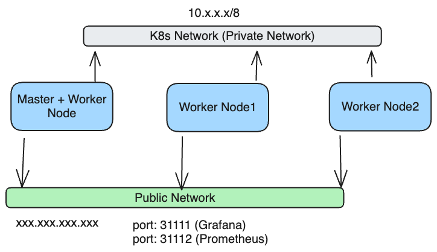
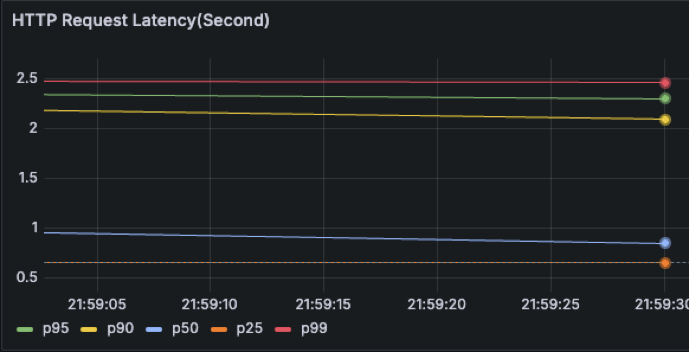

# Kubernetes Workshop 經驗分享

今年有幸參加 Taiwan SRE Summit 2024 並針對 Kubernetes 的內容舉辦一場將近兩小時的 workshop。當初投稿時，希望能夠與過往大多數針對新手的手把手教學有所不同。因此，本次 workshop 採取了一種除錯的思維，為每位開發者提供一套事先佈置好的 Kubernetes Cluster，並要求與會者在兩小時內盡力解決這些問題，並嘗試互相分享解決問題的思路。

本文記錄了本次 workshop 的十個問題，每個問題背後設計的思路以及期望與會者所掌握的 Kubernetes 能力。

# 環境

這次的 workshop 參與人數超乎預期，緊急動用備用環境才讓每個與會者都有一套 Kubernetes 叢集可以使用，以下是本次的環境資訊
1. 總共有 50 套 Kubernetes Cluster (1.28)
2. 每套 K8s cluster 都有三個節點 (2C4G per node)
3. 45 套叢集由 openstack 為基礎所架設的地端機器
4. 5 套叢集由 AKS 提供
5. 每個與會人員都會提供 SSH Key 的方式來連接到所有 Kubernetes 節點
6. https://github.com/cloud-native-taiwan/sre-2024-workshop 放置每道題目需要的 YAML 檔案
7. 每套 Kubernetes 都內建由 Prometheus Kubestack 所安裝的 Prometheus + Grafana，供與會人員去解讀與監控

叢集架構如下，每個節點都會有 Private 與 Public IP，與會者可以透過 Public IP 存取到 Prometheus 與 Grafana，同時節點之間也可以透過 private IP 互相存取

註: AKS 的環境則是由 AKS 處理 Control Plane，因此只有 openstack 自建環境的部分才有 master node 的需求

整個 workshop 的運作流程就是
1. 分配環境，確認存取沒有問題
2. 主持人每兩題為一個單位介紹內容，請與會者部署題目，並且找出問題修復
3. 請解完問題的與會者分享解題思路，怎麼去看待這個問題的

# 題目介紹

以下是這次十個題目的主軸，將會針對每個問題詳細介紹
1. Application Crash
2. Node Not Ready
3. Pod's information shows Invalid Ago
4. Not Able to Access Server Via Service
5. Statefulset crash
6. No Configmap auto update
7. HAP doesn't work
8. Two Pods share the same ReadWriteOnce PVC
9. Prometheus scraps no data
10. P99 latency spikes
    
    
## Application Crash
        
### Question:  
部署一個應用程式，大概 70 左右後，該應用程式就會進入到 CrashLoopBackOff 的階段，嘗試找出問題並且進行修復，確保其不會反覆 Crash

### Root Cause:
該 Pod 所使用的 Memory 與 CPU Limit 都過低，Memory 踩到上限最終觸發了 OOM 的限制，導致 Pod 被移除。

此外 CPU 也踩到上限進入了 CPU Throttling，導致 Liveness Probe 很大的機率沒有辦法順利通過，最終被重啟。
    
    
## Node Not Ready
        
### Question:
透過 kubectl get nodes 後觀察到有節點顯示為 NotReady，範例如下

找出造成 NotReady 的原因並且嘗試修復
    
### Root Cause:
節點上的 Kubelet 沒有辦法順利運行回報狀況，原因是節點上的 swap 意外被打開，導致 kubelet 不能順利運行。關閉 swap 並且重啟 kubelet 即可讓節點恢復正常。    
    
   
## Pod's information shows Invalid Ago
        
### Question:  
部署應用程式，應用程式自己 Crash，但是其 Restart 內顯示的時間有問題，如下

嘗試解釋為什麼會是 Invalid Ago，並且修復
    
### Root Cause:
這邊的時間是由節點上的 Kubelet 回報計算的，所以檢查節點上的時區與時間是否一樣，本問題是節點上的 ntpd client 沒有正確啟動，導致時間不同步，最後回傳的時間差距太大，因此被判定為 Invalid Ago   
    
    
## Not Able to Access Server Via Service
        
### Question:
部署兩個應用程式，其中彼此會透過 Kubernetes Service 去存取，結果 Client 端的 Log 一直顯示沒有辦法存取    
    
### Root Cause:
基本的 YAML 撰寫問題，Service 內的欄位有很多要注意，包含
1. selector 的 label
2. ports 裡面的 port, taragetPort
    
還有 Client 存取的時候不要誤用 targetPort
    
    
## Statefulset crash
        
### Question:  
StatefulSet 的應用程式一直 Crash，要如何再不影響掉資料的情況下修復此問題    

### Root Cause:
從 Pod 的 Log 可以觀察到 PVC 的空間已經滿了，所以需要動態調整 PVC 的大小，因此與會者必須要先行更新 PVC 的空間大小，接者再砍掉 Statefulset Pod，讓其重啟使用擴大後的空間。
    
如果直接修改 StatefulSet YAML 裡面的 PVC 空間並且使用 kubectl apply -f 去更新則是會得到錯誤，因為 PVC 的空間是個不可更動的內容，為了解決這個問題必須採用 cascade=orphan 的形式去移除，譬如
kubectl delete sts --cascade=orphan q5
該操作只會移除 etcd 內的紀錄，但是運行的 Pod 不會移除，透過這種方式就可以將新版的 YAML 給套用到環境上。
   
## No Configmap auto update
        
### Question:
透過 ConfigMap 更新內容，並且重新 Apply 到環境中，結果 Pod 裡面遲遲看不到更新後的結果，理論上應該過一兩分鐘就可以看到更新後的 ConfigMap    
    
### Root Cause:
ConfigMap 的更新會有兩段流程，從 API Server 到 Node Kubelet 再到 Container，但是目前實務上是有限制的，任何有使用 SubPath 的 ConfigMap 都沒有辦法被自動更新，自然也無法透過 iNotify 去監控來處理。唯一的解法只有砍掉 Pod，讓他重新增長才可以 
    
   
## HAP doesn't work
    
### Question:
部署應用程式並且也設定了 HPA 的規則，同時透過 Prometheus 觀察 CPU 用量也是有增長的，從資料來看 CPU 使用率是有超過 HPA 設定的門檻，但是 Deployment 的數量就是沒有增加    
    
### Root Cause:
HPA 與 Prometheus 是兩件獨立的事情， HPA 本身仰賴的是 Metrics API，最簡單的方式就是安裝 Metrics Server，環境中若沒有安裝 Metrics Server，則 HPA 就沒有辦法運作
    
可以透過 kubectl top 等指令觀察看看環境中是否有可以運作的 metrics API，若沒有的話那 HPA 就沒有辦法正常運作。
    
    
    
## Two Pods share the same ReadWriteOnce PVC
   
### Question:
部署一個 ReadWriteOnce 的 PVC 物件，然後有兩個 Deployment 物件都指名使用該 PVC，最終部署結果如下

該 PVC 標示為 ReadWriteOnce，那為什麼可以有這麼多 Pod 同時使用？
    
### Root Cause:

眾人所熟悉的三種部署模型其實都是從節點出發，同時間只能有一個節點可以存取，因此同節點上的 Pod 都還是可以互相存取。以上圖為範例，所有卡在 ContainerCreating 的 Pod 其實都會卡住，因為他們被部署到的節點上沒有對應的 PVC 可以用。
    
如果想要真正達到以 Pod 為主軸去確保同時間只能有一個 Pod 使用，則要使用 ReadWriteOncePod 這種規則，其設計文件如下
https://github.com/kubernetes/enhancements/blob/master/keps/sig-storage/2485-read-write-once-pod-pv-access-mode/README.md    
   
當 PVC 採取此種模式時，所有的 Pod 都會進入到 Pending 狀態，結果如下圖

    
## Prometheus scraps no data

### Question:
部署一個已經實作 Prometheus Endpoint 的應用程式，搭配 ServiceMonitor 來告知 Prometheus，結果從 Prometheus 上都看不到相關的資料，手動去連接服務都是可以正常存取的。

    
### Root Cause:
使用者部署的 ServiceMonitor 的物件，結果 Prometheus 並沒有正確的讀取該物件，所以從 Prometheus 的網頁上都看不到相關的 Taget，原因是 Prometheus 的 Operator 中有透過 ServiceMonitorSelector 的物件去描述 ServiceMonitor 的規則。

因此團隊想要使用 ServiceMonitor 時一定要確認 Label 是否設定正確，否則就會部署到環境中卻沒有辦法生效
    
## P99 latency spikes
        
### Question:  
部署應用程式後透過 Grafana 觀察 HTTP Latency 的現象，會觀察到 P90 後的 Latency 有特別高的情況，範例如下

  
    
### Root Cause:
Server 的 CPU Limit 太低，導致 CPU Throttling 的問題發生，因此當連線過多的時候就會有部分的連線沒有辦法於每個 CFS Period 內處理完畢，這部分都可以透過 Prometheus 內去觀察 Throttling 的情況。
    
修正後的結果應該要類似下圖，最終都會靠近彼此
    

    
    
# 結論

1. 以時間來說，兩個小時其實不太夠，前面的環境存取就有遇到一些小問題，由於自己測試的環境都是基於 MacOS/Linux 的筆電為主，沒有考慮到使用 windows 的與會者，其下載 SSH Private Key 的時候可能會有格式上的問題，導致有滿多與會者花了不少時間在處理這些問題
2. 大家的能力不均，所以解決問題上面所花費的時間有所差異，很難讓所有人一起前進，一定會有人沒有辦法完全跟上
3. 考慮到 Kubernetes 生態系太廣，所以設計問題的時候都盡量以 Kubernetes 原生為主，這部分的出題會愈來愈難找
4. 一直很想要出跟 CPU Throlling 有關的問題，但是這類型的問題太講求 CPU 跟環境問題，以問題一來說，當天有幾位與會人員的環境都沒有踩到任何問題，未來如果要繼續設計這類型的問題的話，要思考一下該怎麼設計。
5. 整體成效來說算滿不錯的，得到很多正面的回饋，都覺得這種實際動手並且從技術面探討問題的 workshop 能夠帶回去的經驗與學習更多，普遍都希望未來能夠有第二場類似的活動。
